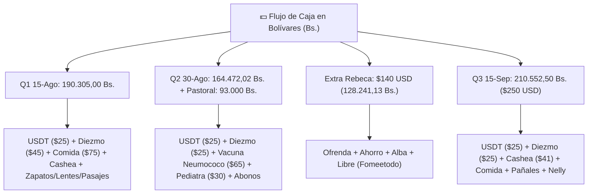
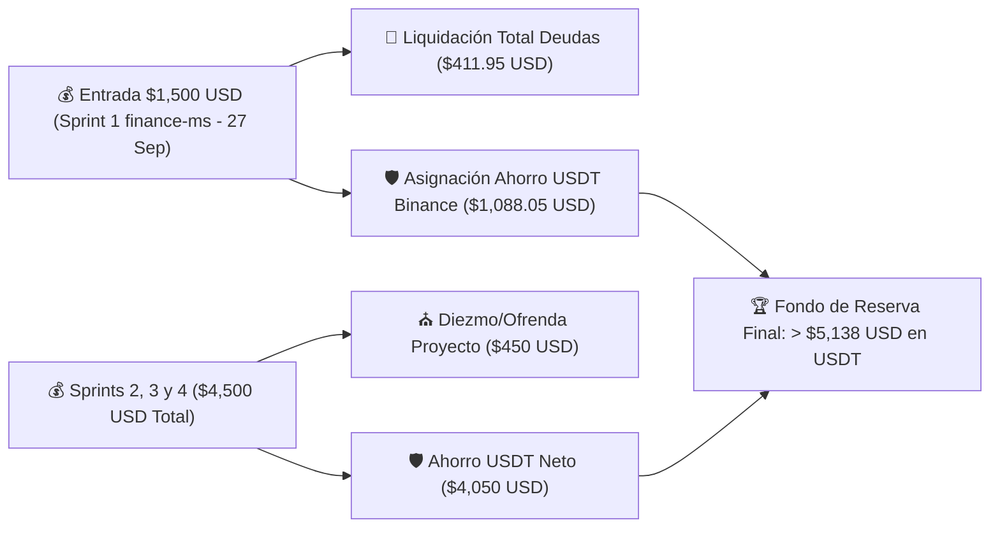

# 📊 Informe Financiero Auditado: Gastos Reales del Cuaderno & Estrategia de Saneamiento

*Análisis exhaustivo consolidado a partir de los registros contables manuscritos del cuaderno personal (imágenes `4997157817579933185_121.jpg` a `4997157817579933188_121.jpg`), evaluando ingresos, ejecuciones quincenales en Bolívares (Bs.) y USD ($), fugas de dinero, peso de pasivos y plan de aceleración de ahorro en USDT.*

---

## 🎯 1. Presupuesto Base Mensual vs. Regla de Distribución Teórica

Según la planificación anotada en el cuaderno (**Imagen 1: `4997157817579933185_121.jpg`**):

### **A. Estructura de Ingresos y Gastos Fijos Mensuales**

- **Ingreso Base Mensual**: **$620.00 USD** (Sueldo Xetux + Sueldo Pastoral).
- **Gastos Fijos Teóricos Asignados**: **$438.00 USD**

| Partida de Gasto Fijo | Monto Asignado ($ USD) | Distribución Quincenal / Notas |
| :--- | :---: | :--- |
| **Alquiler** | $140.00 | Cobertura vivienda familiar / apoyo a papá |
| **Internet** | $18.00 | Servicio de conectividad principal |
| **Comida / Mercado** | $150.00 | Split quincenal: $75.00 + $75.00 |
| **Gasolina** | $15.00 | Combustible para traslado en moto |
| **Cita Pediatría (Caleb)** | $30.00 | Control médico mensual |
| **Lavado de Moto** | $5.00 | Mantenimiento preventivo |
| **Artículos de Higiene** | $30.00 | Split quincenal: $15.00 + $15.00 |
| **Diezmo (10%)** | $50.00 | Mayordomía cristiana sobre base aproximada |
| **TOTAL GASTOS FIJOS** | **$438.00** | **70.6% del ingreso mensual base** |

- **Diferencia Operativa Bruta**: $620.00 - $438.00 = **$182.00 USD**.
- **Ahorro Programado (10%)**: $62.00 USD.
- **Margen Libre Disponible**: **$120.00 USD** (para gastos discrecionales o emergencias).

### **B. Regla Presupuestaria Anotada en Cuaderno**
- **75% Gastos Fijos**: En la práctica el gasto fijo base representa el **70.6%** de $620 USD.
- **15% Deseos / Discrecional**: Equivalente a **$93.00 USD/mes**.
- **10% Ahorro Mínimo**: Equivalente a **$62.00 USD/mes**.

---

## 📝 2. Ejecución Real por Quincenas (Agosto - Septiembre 2026)

---

### **A. Quincena 15 de Agosto (`4997157817579933186_121.jpg`)**
- **Ingreso Total Recibido**: **190.305,00 Bs.**

#### **1. Salidas Principales / Compromisos Base:**
- Compra 25$ USDT: 21.813,75 Bs.
- Diezmo 45$: 34.254,00 Bs. (referencia en Bs: 19.000)
- Comida 75$: 57.091,50 Bs. (referencia en Bs: 17.000)
- Artículos de Higiene 15$: 11.478,30 Bs.
- **Subtotal Inicial**: **124.578,45 Bs.**
- **Saldo Restante en Caja**: 190.305,00 - 124.578,45 = **65.726,55 Bs.**

#### **2. Gastos Secundarios y Cuotas:**
- Lavado de moto: 3.806,10 Bs. (Saldo: 61.920,45 Bs.)
- Cuota Cashea: 8.025,20 Bs. (Saldo: 53.895,25 Bs.)

#### **3. Compras Extra / Imprevistos / Cuotas Iniciales (Total 29.822,17 Bs.):**
- 2 pares de zapatos: 23.005,80 Bs. (Abono a tasa de 30$ / 57$ -> 9.766,86 Bs.)
- Lentes (cuota inicial): 16.815,80 Bs. (+22$ pendiente)
- Pasajes (cuota inicial): 7.492,23 Bs.
- Comida cumpleaños Mervel: 8.000,00 Bs.
- Jabón en polvo: 5.500,00 Bs.
- Comida extra suplementaria: 19.000,00 Bs.
- Gasolina: 1.927,68 Bs.

---

### **B. Quincena 30 de Agosto & Sueldo Pastoral (`4997157817579933187_121.jpg`)**
- **Ingreso Quincena Ordinaria**: **164.472,02 Bs.**
- **Ingreso Extraordinario Sueldo Pastoral (17/08/26)**: **93.000,00 Bs. ($120.00 USD)**

#### **1. Ejecución Quincena 30/08:**
- Compra USDT: 22.800,00 Bs.
- Diezmo 25$: 19.630,00 Bs.
- Cashea (Gustos): $27.70 USD
- **Vacuna Neumococo (Caleb - Gasto Médico Extraordinario)**: **$65.00 USD / 62.406,00 Bs.**
- **Cita Pediátrica**: **$30.00 USD / 23.625,00 Bs.** (ASI)
- **Alquiler $140.00 USD**: No cubierto por caja ordinaria; se invirtió el sueldo pastoral para sostener este y otros compromisos al no poder recibir el dinero el titular.

#### **2. Liquidación / Aplicación del Sueldo Pastoral (93.000,00 Bs. / $120 USD):**
- Compra USDT: 22.800,00 Bs.
- Compra Rollo Sublimación (Insumos): 33.638,98 Bs.
- **Saldo Disponible Sueldo Pastoral**: **36.562,00 Bs.**
- **Distribución de Abonos a Micro-deudas**:
  - Abono Lentes: 11.344,49 Bs.
  - Abono Préstamo Beijing: 24.785,00 Bs.
  - Abono Pasajes: 10.102,62 Bs.

---

### **C. Ingreso Adicional Rebeca & Quincena 15 de Septiembre (`4997157817579933188_121.jpg`)**

#### **1. Ingreso Rebeca (Pág): $140.00 USD (128.241,13 Bs.)**
- Ofrenda: 10.919,30 Bs.
- Ahorro: 23.428,59 Bs.
- Alba: 45.800,00 Bs.
- Libre / Gustos ("Fomeetodo"): 24.015,28 Bs. ($50.00 USD)

#### **2. Quincena 15 de Septiembre: 210.552,50 Bs. ($250.00 USD)**
- Compra 25 USDT: 20.812,25 Bs.
- Diezmo 25$: 20.812,25 Bs.
- Comida 75$: 63.165,75 Bs. (abono parcial aplicado: 33.757,00 Bs., restan 29.408,75 Bs. por saldar).
- Cuota Cashea: 41.00$ USD / 34.530,61 Bs.
- Artículos de Higiene 15$: 12.633,15 Bs.
- Pañales Caleb: Cubierto.
- Alquiler Papá: Cubierto.
- Tortas / Esparcimiento: 6.800,00 Bs.

---

## 🔍 3. Diagnóstico Financiero: Fugas, Peso de Pasivos y Cobertura

### **A. Fugas de Dinero & Desviación Presupuestaria**
1. **Fuga en Gustos e Impulsos Discrecionales ("Fomeetodo", Tortas, Comidas Cumpleaños)**:
   - Se registran salidas recurrentes fuera de la canasta alimentaria estándar ($50 USD libre Rebeca, 8.000 Bs. cumpleaños, 6.800 Bs. tortas, etc.).
   - Estas pequeñas salidas suman individualmente montos equivalentes a 1-2 meses de servicio de internet o gasolina.
2. **Compras Fragmentadas vía Cashea**:
   - Cashea genera un compromiso financiero rígido antes de cobrar la quincena ($8.025 Bs., $27.70 USD, $41.00 USD / 34.530 Bs.).
   - Representa el **16.4% de una quincena promedio en Bs.**, reduciendo drásticamente la capacidad de compra de alimentos frescos.

### **B. Inventario de Pasivos y Compromisos Pendientes**

| Deuda / Pasivo | Monto Original / Estado | Monto Pendiente Estimado | Criticidad |
| :--- | :--- | :---: | :---: |
| **Pasivo con Nelly** | Préstamo personal acumulado | **$258.25 USD** | 🔴 ALTA |
| **Cashea (Cuotas Activas)** | Financiamiento de artículos/gustos | **$41.00 USD + $27.70 USD** | 🟠 MEDIA |
| **Lentes (Saldo pendiente)** | Inicial 16.815 Bs., Abono 11.344 Bs. | **~$15.00 USD** | 🟡 BAJA |
| **Préstamo Beijing** | Abono 24.785 Bs. realizado | **~$10.00 - $15.00 USD** | 🟡 BAJA |
| **Franelas** | Adquisición pendiente por pagar | **$45.00 USD** | 🟡 BAJA |
| **Correa Secadora** | Repuesto para electrodoméstico | **~$15.00 - $20.00 USD** | 🟡 BAJA |
| **TOTAL PASIVOS PENDIENTES** | | **~$411.95 USD** | |

### **C. Efectividad de Cobertura**
- **Cobertura Operativa Fija**: El sueldo regular ($620 USD) cubre holgadamente los gastos fijos teóricos ($438 USD).
- **Vulnerabilidad ante Gastos de Salud Infantil**: La aparición de gastos de salud no presupuestados (Vacuna Neumococo $65 USD + Cita Pediatra $30 USD = $95 USD en una sola quincena) absorbe casi el 40% del flujo en Bolívares, obligando a fragmentar el pago de la comida o a diferir alquileres y diezmos.

---

## 🚀 4. Estrategia de Optimización & Plan de Liquidación (Plan B Exprés)

Con la llegada de los **4 cobros por Hitos del proyecto `finance-ms` ($1,500.00 USD / Sprint = $6,000.00 USD Total)**, se implementará una estrategia de saneamiento acelerado y máxima capitalización en USDT.

---

### **A. Plan de Liquidación de Deudas en 1 Solo Paso (Sprint 1 - 27 de Septiembre)**

Apenas se perciba la primera entrega de **$1,500.00 USD** del proyecto `finance-ms` el **27/09/2026**:

1. **Saldar Pasivo Completo con Nelly**: **$258.25 USD** (Finiquito al 100%).
2. **Liquidar Cuotas de Cashea**: **$68.70 USD** (Cierre definitivo de cuentas activas).
3. **Liquidar Remanente Lentes, Beijing, Franelas y Repuesto Correa**: **~$85.00 USD**.
4. **Impacto Inmediato**: **Cero deudas en 24 horas**. Liberación del 100% de la quincena laboral para caja corriente a partir del 1 de octubre.

---

### **B. Proyección de Capitalización y Ahorro en USDT ($6,000.00 USD)**

| Fecha Hito | Fuente (`finance-ms`) | Monto Entrante | Asignación Deudas / Gastos | Asignación Diezmo | **Ahorro USDT Neto** | **Ahorro Acumulado** |
| :---: | :--- | :---: | :---: | :---: | :---: | :---: |
| **27-Sep-2026** | Sprint 1 (CxP/SENIAT) | $1,500.00 USD | $411.95 USD (Deudas) | $150.00 USD | **$938.05 USD** | **$938.05 USD** |
| **08-Oct-2026** | Sprint 2 (Egresos/TXT) | $1,500.00 USD | $0.00 USD | $150.00 USD | **$1,350.00 USD** | **$2,288.05 USD** |
| **19-Oct-2026** | Sprint 3 (CxC/CSV) | $1,500.00 USD | $0.00 USD | $150.00 USD | **$1,350.00 USD** | **$3,638.05 USD** |
| **30-Oct-2026** | Sprint 4 (Release/Prod) | $1,500.00 USD | $0.00 USD | $150.00 USD | **$1,350.00 USD** | **$4,988.05 USD** |

*Nota: Sumando los ahorros quincenales ordinarios en USDT ($25 a $50/quincena), la meta de **$5,200.00+ USDT** se alcanzará holgadamente antes del 15 de noviembre de 2026.*

---

### **C. Protocolo de Estabilización de Caja Semanal en Bolívares**

1. **Creación del Fondo de Salud Infantil Programado**:
   - Apartar **$40.00 USD mensuales** ($20 por quincena) de la quincena regular para un sobre/cuenta dedicada a citas pediátricas y vacunas de Caleb, evitando descalabros en la caja de mercado.
2. **Blindaje de Compras de Mercado (Proteínas y Verduras)**:
   - Al cobrar la quincena laboral (ej. 210,000+ Bs.), ejecutar inmediatamente la transferencia para el diezmo, alquiler y mercado de proteínas (Prioridad A) antes de realizar compras discrecionales.
3. **Regla "Zero-Cashea" por 60 Días**:
   - Suspendida la compra de artículos no esenciales por financiamiento a plazos hasta acumular el fondo de reserva de 3 meses.

---

## 🔗 Documentos Relacionados en la Wiki

- [[Área Finanzas - Gestión Económica|pilar-finanzas-personales.md]]
- [[Plan Financiero Estratégico & Gestión de Presupuesto 2026|plan-financiero-2026.md]]
- [[Planificación de Sprints & Backlog Scrum: Módulo de Finanzas (finance-ms)|../proyectos/sprints-modulo-finanzas.md]]
- [[Dashboard de Vida & Centro de Control (Life OS)|../life-dashboard.md]]
- [[Subagente Finance Manager|../../agents/finance_manager.md]]
