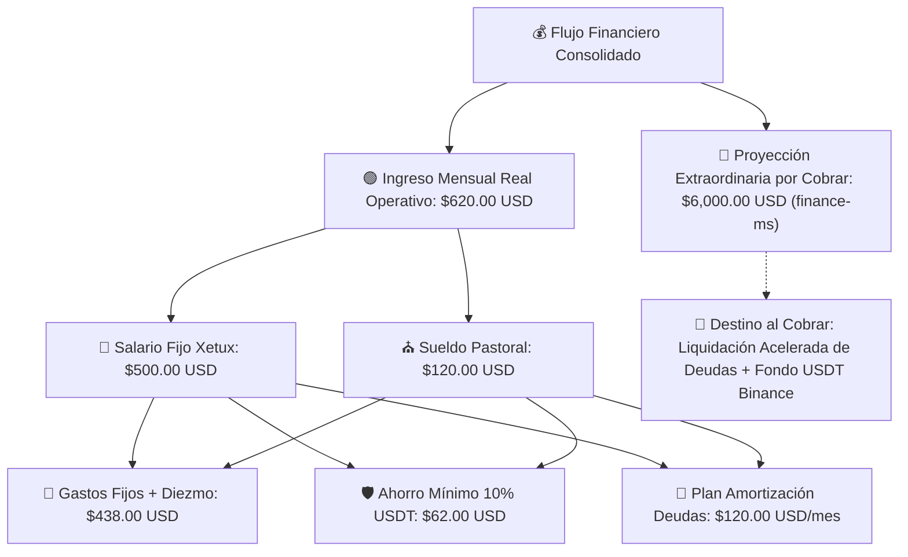

# 💰 Plan Financiero Estratégico & Gestión de Presupuesto 2026

*Plan de salud financiera unificado (Life OS & Proyectos) elaborado por ALFRED y el [Subagente Finance Manager](../../agents/finance_manager.md) para la gestión eficiente del flujo de caja, diezmos/ofrendas, gastos familiares y proyectos de desarrollo.*

---

## 🎯 1. Objetivos Financieros Principales

1. **Mayordomía & Diezmo Fiel**: Priorizar el 10% de diezmos y ofrendas sobre la totalidad de los ingresos percibidos.
2. **Optimización del Flujo de Caja en Bolívares (Bs.)**: Garantizar la cobertura de gastos fijos y la estabilización de la canasta alimentaria básica con los ingresos mensuales reales actuales (**$620.00 USD/mes** = $500.00 Xetux + $120.00 Sueldo Pastoral).
3. **Saneamiento Gradual Conservador de Deudas ($408.07 USD)**: Eliminar el 100% de pasivos (Nelly, Cashea, Lentes, Beijing, Franelas) mediante el margen libre mensual real (**$120.00 USD/mes**) en un plazo de 4 meses (Octubre 2026 – Enero 2027).
4. **Proyección de Ingresos Extraordinarios (`finance-ms` - $6,000.00 USD)**: Clasificar las 4 entregas del Plan B Exprés ($1,500.00 USD / Sprint) como **Proyección de Ingreso Extraordinario Futuro por Cobrar (Hitos Pendientes)**, sin incluirlos en la caja operativa presente ni depender de ellos para saldar pasivos actuales.

---

## 💵 2. Estructura de Ingresos (Real vs. Proyección Futura)

### **A. Ingresos Recurrentes Laborales Reales ($620.00 USD/mes)**
- **Salario Fijo Xetux (IT Support)**: $500.00 USD/mes.
- **Sueldo Pastoral**: $120.00 USD/mes.
- **Uso Operativo**: Cobertura del 100% de gastos fijos ($438 USD), ahorro mínimo ($62 USD) y saneamiento gradual de deudas ($120 USD).

### **B. Proyección de Ingreso Extraordinario Futuro por Cobrar (`finance-ms` - $6,000.00 USD)**
- **Estado**: Aprobado por Dirección | **AÚN NO COBRADO NI PAGADO**.
- **Cronograma de Cobro Condicionado a Hitos de Entrega**:
  1. **Hito 1 (Pendiente)**: **$1,500.00 USD** (Aprobación Sprint 1: MVP CxP & Motor SENIAT).
  2. **Hito 2 (Pendiente)**: **$1,500.00 USD** (Aprobación Sprint 2: Egresos & TXT BNC/Provincial).
  3. **Hito 3 (Pendiente)**: **$1,500.00 USD** (Aprobación Sprint 3: CxC & Conciliación CSV).
  4. **Hito 4 (Pendiente)**: **$1,500.00 USD** (Aprobación Sprint 4: Release Staging/Prod).

---

## 📊 3. Presupuesto Operativo Mensual Real ($620.00 USD)

| Partida / Destino | Monto ($ USD) | Porcentaje | Propósito / Observaciones |
| :--- | :---: | :---: | :--- |
| **⛪ Diezmo (Mayordomía)** | $50.00 USD | 8.1% | Asignación sobre base de presupuesto fijo (10% sobre margen bruto: $62.00 USD). |
| **🏡 Gastos Fijos Operativos** | $388.00 USD | 62.5% | Alquiler ($140), Mercado ($150), Higiene ($30), Salud Caleb ($30), Internet ($18), Gasolina ($15), Moto ($5). |
| **🛡️ Ahorro Mínimo USDT** | $62.00 USD | 10.0% | Fondo de Reserva intocable (Compras quincenales USDT Binance). |
| **🎯 Capacidad de Abono a Deudas** | $120.00 USD | 19.4% | Amortización de pasivos (Nelly, Cashea, Lentes, Beijing, Franelas). |
| **TOTAL INGRESO REAL** | **$620.00 USD** | **100.0%** | **Caja Operativa Autosuficiente sin Deuda Adicional.** |

---

## 🧹 4. Plan Conservador de Amortización Gradual de Deudas ($408.07 USD)

Utilizando exclusivamente los **$120.00 USD/mes** de capacidad real de abono:

- **Octubre 2026 ($120.00 USD)**:
  - Liquida **Cashea**: $68.70 USD (Cierre total de cuotas activas).
  - Liquida **Lentes**: $11.34 USD (Cancelado 100%).
  - Liquida **Préstamo Beijing**: $24.78 USD (Cancelado 100%).
  - Abono inicial a **Nelly**: $15.18 USD.
  - *Pasivos Restantes al 31-Oct*: $288.07 USD (Nelly $243.07 + Franelas $45.00).

- **Noviembre 2026 ($120.00 USD)**:
  - Liquida **Franelas**: $45.00 USD (Cancelado 100%).
  - Abono a **Nelly**: $75.00 USD.
  - *Pasivos Restantes al 30-Nov*: $168.07 USD (Nelly).

- **Diciembre 2026 ($120.00 USD)**:
  - Abono principal a **Nelly**: $120.00 USD.
  - *Pasivos Restantes al 31-Dic*: $48.07 USD (Nelly).

- **Enero 2027 ($48.07 USD)**:
  - Finiquito total a **Nelly**: $48.07 USD.
  - *Saldo de Deudas*: **$0.00 USD (Saneamiento 100% completado con recursos propios)**.
  - Remanente liberado a Ahorro/Esparcimiento: $71.93 USD.

---

## 🛒 5. Protocolo de Compras & Flujo de Caja Semanal

### **A. Estado Actual del Saldo Operativo (Al 16-Sep-2026)**
- **Gasto Realizado Hoy**: 33,000 Bs. (Alimentos y productos de higiene).
- **Saldo Disponible Restante**: **29,000 Bs.**

### **B. Lista de Compras Priorizada para el Saldo Restante**
1. **Prioridad A (Proteínas - ~18,000 - 20,000 Bs.)**: Pollo (pechuga/muslos), Carne picada/molida.
2. **Prioridad B (Verduras Básicas - ~6,000 - 7,000 Bs.)**: Papa, auyama, cebolla, zanahoria, tomate (incluye alimentos aptos para BLW de Caleb).
3. **Prioridad C (Frutas - ~3,000 - 4,000 Bs.)**: Lechosa, piña, fresas.

---

## 📈 6. KPIs & Control de Salud Financiera

- **Tasa de Ahorro Base**: 10% mensual constante ($62.00 USD/mes en USDT) de ingresos ordinarios.
- **Autonomía Operativa**: 100% de gastos fijos y deudas amortizados con sueldo regular ($620.00 USD/mes).
- **Regla Zero-Cashea**: Suspensión total de nuevos créditos a plazos por 60-90 días hasta terminar saneamiento.
- **Auditoría Diaria**: Registro continuo de gastos por nota de voz o mensaje procesado por ALFRED en `raw/inbox/`.

---

## 🔗 Enlaces Relacionados (Wikilinks)
- [[pilar-finanzas-personales|Área Finanzas - Gestión Económica]]
- [[sprints-modulo-finanzas|Planificación de Sprints & Backlog Scrum: Módulo de Finanzas (finance-ms)]]
- [Subagente Finance Manager](../../agents/finance_manager.md)
- [[life-dashboard|Dashboard de Vida & Centro de Control]]
