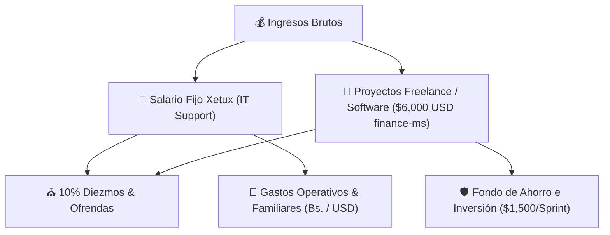

# 💰 Plan Financiero Estratégico & Gestión de Presupuesto 2026

*Plan de salud financiera unificado (Life OS & Proyectos) elaborado por ALFRED y el [[Subagente Finance Manager|../../agents/finance_manager.md]] para la gestión eficiente del flujo de caja, diezmos/ofrendas, gastos familiares y proyectos de desarrollo.*

---

## 🎯 1. Objetivos Financieros Principales

1. **Mayordomía & Diezmo Fiel**: Priorizar el 10% de diezmos y ofrendas voluntarias sobre la totalidad de ingresos brutos (laborales y de proyectos).
2. **Optimización del Flujo de Caja en Bolívares (Bs.)**: Garantizar un saldo mínimo operativo diario en caja para gastos corrientes (compras de mercado, servicios y contingencias), manteniendo el presupuesto bajo estricto control.
3. **Capitalización por Hitos de Desarrollo ($6,000.00 USD)**: Canalizar de forma estratégica los 4 cobros del **Plan B Exprés** ($1,500.00 USD / Sprint) del módulo `finance-ms` hacia el **Fondo de Reserva Familiar y Ahorro de Emergencia**.
4. **Independencia & Rentabilidad Freelance**: Evaluar la rentabilidad neta de cada hora de desarrollo y mantener cero deudas innecesarias.

---

## 💵 2. Estructura de Ingresos (Dual Income Stream)

### **A. Ingresos Recurrentes Laborales (Xetux)**
- **Destino**: Cobertura de gastos fijos mensuales (servicios, alimentación básica, salud familiar, mantenimiento del hogar).

### **B. Ingresos Extraordinarios por Proyectos (`finance-ms` - Plan B Exprés)**
- **Monto Total**: **$6,000.00 USD** (Contrato Fast-Track de 6 Semanas | 4 Entregas de $1,500.00 USD).
- **Cronograma de Cobro por Hitos**:
  1. **Hito 1 (27-Sep-2026)**: **$1,500.00 USD** (Aprobación Sprint 1: MVP CxP & Motor SENIAT).
  2. **Hito 2 (08-Oct-2026)**: **$1,500.00 USD** (Aprobación Sprint 2: Egresos & TXT BNC/Provincial).
  3. **Hito 3 (19-Oct-2026)**: **$1,500.00 USD** (Aprobación Sprint 3: CxC & Conciliación CSV).
  4. **Hito 4 (30-Oct-2026)**: **$1,500.00 USD** (Aprobación Sprint 4: Release Staging/Prod).

---

## 📊 3. Regla Presupuestaria de Distribución (Modelo 50/20/20/10)

| Categoría | Porcentaje | Propósito / Destino | Observaciones |
| :--- | :---: | :--- | :--- |
| **⛪ Diezmos & Ofrendas** | **10%** | Mayordomía Cristiana | Calculado sobre ingresos totales brutos. |
| **🏡 Gastos Fijos Operativos** | **50%** | Alimentación, servicios, hogar, salud de Caleb | Control estricto de compras semanales en Bs. |
| **🛡️ Fondo de Reserva & Ahorro** | **20%** | Fondo de Emergencia en Divisas (USD) | Fortalecido principalmente con las entregas de `finance-ms`. |
| **💻 Crecimiento & Equipamiento** | **20%** | Licencias, herramientas dev, formación, imprevistos | Reinversión en capacidad técnica y esparcimiento. |

---

## 🛒 4. Protocolo de Compras & Flujo de Caja Semanal

### **A. Estado Actual del Saldo Operativo (Al 16-Sep-2026)**
- **Gasto Realizado Hoy**: 33,000 Bs. (Alimentos y productos de higiene).
- **Saldo Disponible Restante**: **29,000 Bs.**

### **B. Lista de Compras Priorizada para el Saldo Restante**
1. **Prioridad A (Proteínas - ~18,000 - 20,000 Bs.)**: Pollo (pechuga/muslos), Carne picada/molida.
2. **Prioridad B (Verduras Básicas - ~6,000 - 7,000 Bs.)**: Papa, auyama, cebolla, zanahoria, tomate (incluye alimentos aptos para BLW de Caleb).
3. **Prioridad C (Frutas - ~3,000 - 4,000 Bs.)**: Lechosa, piña, fresas.

---

## 📈 5. KPIs & Control de Salud Financiera

- **Tasa de Ahorro Objetivo**: ≥ 25% del ingreso total consolidado.
- **Días de Fondo de Emergencia**: Cobertura de al menos 3 a 6 meses de gastos fijos.
- **Cumplimiento de Hitos `finance-ms`**: 100% de cobranza a tiempo según las fechas timeboxed de los Sprints.
- **Auditoría Diaria**: Registro continuo de gastos por nota de voz o mensaje procesado por ALFRED en `raw/inbox/`.

---

## 🔗 Enlaces Relacionados (Wikilinks)
- [[Área Finanzas - Gestión Económica|pilar-finanzas-personales.md]]
- [[Planificación de Sprints & Backlog Scrum: Módulo de Finanzas (finance-ms)|../proyectos/sprints-modulo-finanzas.md]]
- [[Subagente Finance Manager|../../agents/finance_manager.md]]
- [[Dashboard de Vida & Centro de Control|../life-dashboard.md]]
