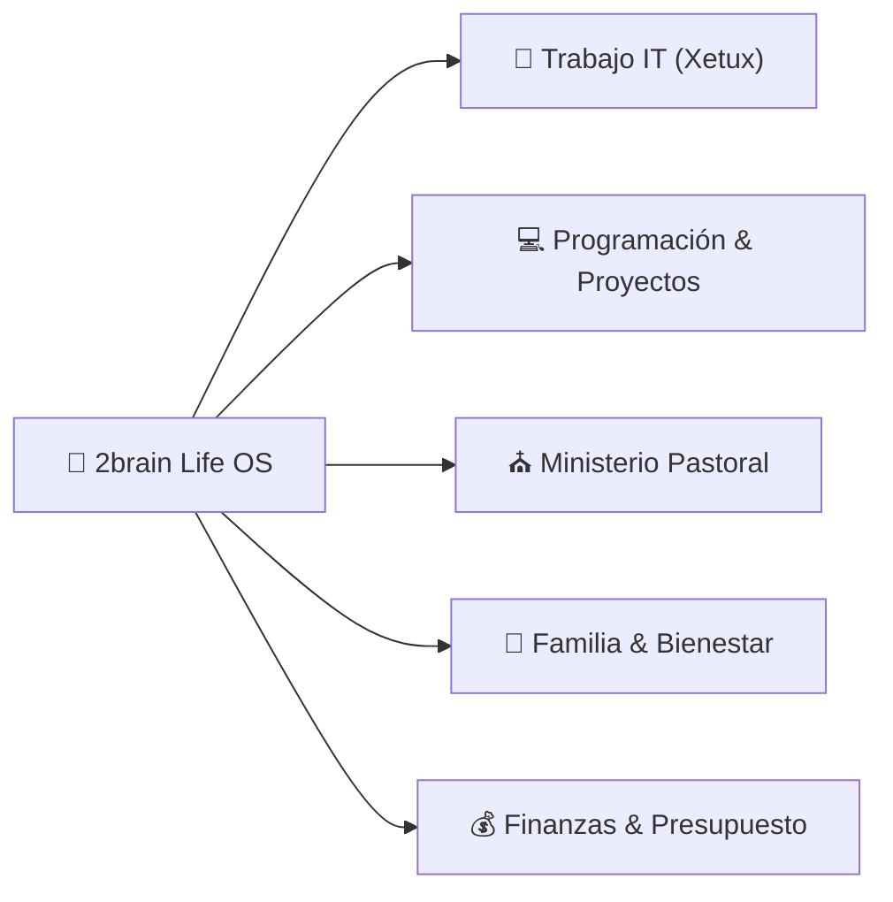

# 🚀 Dashboard de Vida & Centro de Control (Life OS)

*Cuadro de mando unificado para organizar, priorizar y ejecutar la vida laboral, ministerial, técnica, familiar y financiera.*

---

## 📅 Resumen de la Semana (Vista Ejecutiva)

---

## 🎯 Prioridades Activas por Área

### ⛪ 1. Area Ministerial (Pastorado)
- [x] Diseñar estructura de la nueva serie de discipulado: [[serie-discipulado-caminando-juntos|Serie de Sermones: Caminando Juntos - De Creyentes a Discípulos]]
- [x] Estudio exegético del Sermón 1: [[sermon-1-de-la-multitud-a-la-mesa-estudio|Estudio Exegético y Homilético - Sermón 1: De la Multitud a la Mesa]]
- [x] Estudio exegético del Sermón 2: [[sermon-2-el-modelo-del-maestro-estudio|Estudio Exegético y Homilético - Sermón 2: El Modelo del Maestro]]
- [ ] **Agendado en Google Calendar Personal (17-Sep 12:30 – 13:30 PM)**: Lectura y meditación del [[sermon-2-el-modelo-del-maestro-estudio|Estudio Exegético y Homilético - Sermón 2: El Modelo del Maestro]] durante el almuerzo.
- [x] Ingestar e integrar el [[sistema-productividad-pastor-ingeniero|Sistema de Productividad del Pastor-Ingeniero]] ([Resumen Exec|summaries/manual-maestro-pastor-ingeniero.md]).
- [ ] **En Progreso**: Armar la predicación final del Sermón 1 para el domingo.
- [ ] **Próximo**: Preparar la guía de preguntas para grupos pequeños/células.

### 🏢 2. Area Trabajo (Analista IT & Soporte Xetux / MasterHub)
- [x] **Migración Masiva a Plane (`projects.mastergroupve.com`)**: 97/97 tareas y épicas importadas exitosamente desde ClickUp a Plane con jerarquías y módulos vinculados (`Finanzas-MS`, `HR-MS`, `Helpdesk-MS`, `Inventario-MS`, `Auth-MS`, `MKT-MS`).
- [x] **Configuración de Board Kanban & QA**: Creado nuevo estado y bloque `Testing` en Plane.
- [x] **Estandarización Git en Monorepo MasterHub (`MG-HUB`)**: Consagrada rama `dev` como base de integración y staging continuo junto a ramas `feature/*` y Conventional Commits.
- [x] **Automatización CI/CD con GitHub Actions (Frodo)**:
  - Pipeline de Staging (`deploy-staging.yml` ➔ `https://dev.mastergroupve.com/` vía SSH + Docker Compose).
  - Pipeline de Producción (`deploy-production.yml` ➔ `https://masterhub.mastergroupve.com/`).
  - Configuración Nginx con SSL en `deploy/nginx/` y documentación en `docs/CI_CD_WORKFLOW.md`.

### 💻 3. Area Programación & 🚀 Proyectos de Software
- [x] **WebCastro — Sprint y Despliegue 100% Culminado**:
  - [x] Módulo de Consultas persistiendo en PostgreSQL Neon y accesible desde el panel de Payload CMS.
  - [x] Botones flotantes de WhatsApp actualizados (`+58 422 038-7323` y `+58 412 964-3616`).
  - [x] Badge "100% Calidad Garantizada" reubicado y párrafos justificados en Sobre Nosotros.
  - [x] Checklist interactivo con viñetas y checks dorados en Hero "Quiénes Somos".
  - [x] Build en Vercel restablecido y rama `origin/dev` sincronizada con `origin/main`.
- [x] **MasterHub (MS-FINANCE)**: Andamiaje base (`finance-ms`) desplegado y fusionado en `dev`.
- [ ] **Próximo Turno**: Configurar Secretos de GitHub en el repositorio para activar los despliegues automáticos por SSH y continuar con los sprints de `finance-ms`.

### 💰 4. Area Finanzas (Gestión Económica)
- [x] **Análisis de Gastos Reales del Cuaderno & Plan Conservador**: [[analisis-gastos-reales-cuaderno|Informe Financiero Auditado: Gastos Reales del Cuaderno]] (Auditoría de gastos, plan de amortización gradual de deudas $408.07 USD en 4 meses con $120 USD/mes).
- [x] **Plan Financiero Estratégico 2026 elaborado con Subagente Finance Manager**: [[plan-financiero-2026|Plan Financiero Estratégico & Gestión de Presupuesto 2026]] (Presupuesto operativo basado en $620 USD/mes reales).
- [x] **Clasificación de Ingresos `finance-ms` ($6,000.00 USD)**: [[sprints-modulo-finanzas|Sprints & Backlog Scrum finance-ms]] (Registrado como *Proyección de Ingreso Extraordinario Futuro por Cobrar - Hitos Pendientes*).
- [x] **Balance & Reestructuración de Compras (Presupuesto 29,000 Bs.)**: Ingestado y categorizado en A/B/C ([voice_20260916_221908.md](file:///C:/Users/vmontoyaMG/Desktop/2brain/raw/inbox/voice_20260916_221908.md)).
- [ ] Control continuo de diezmos/ofrendas (10%), ahorro intocable ($62 USD/mes) y abono mensual de deudas ($120 USD/mes).

### 🏡 5. Area Familiar & Vida Personal
- [x] Establecer protocolo de **Madrugada Protegida** y **Desconexión Sagrada 18:30 - 20:30** (Cero pantallas).
- [x] Diseñar el [[menu-semanal-recetas-saludables|Menú Semanal Nutritivo & Lista de Compras]] ([Resumen Exec|summaries/recetas-menu-semanal.md]).
- [ ] Bloqueo de tiempo de calidad familiar en la agenda semanal.
- [ ] Hábito de salud, ejercicio y descanso espiritual.

---

## 🤖 Asistentes de Ejecución (Subagentes a tu Servicio)

- ⛪ Para predicas o consejería ➔ Usa **Pastoral Assistant** (`agents/pastoral_assistant.md`)
- 🛠️ Para tickets y manuales IT ➔ Usa **IT Support Expert** (`agents/it_support_expert.md`)
- 🎨 / ⚙️ Para avanzar proyectos de código ➔ Usa **Frontend UI Expert** o **Backend JS Expert**
- 💰 Para ajustar presupuestos ➔ Usa **Finance Manager** (`agents/finance_manager.md`)

---

## 🔗 Accesos Rápidos a la Wiki
- [[index|Índice Maestro]]
- [[log|Registro de Actividades]]
