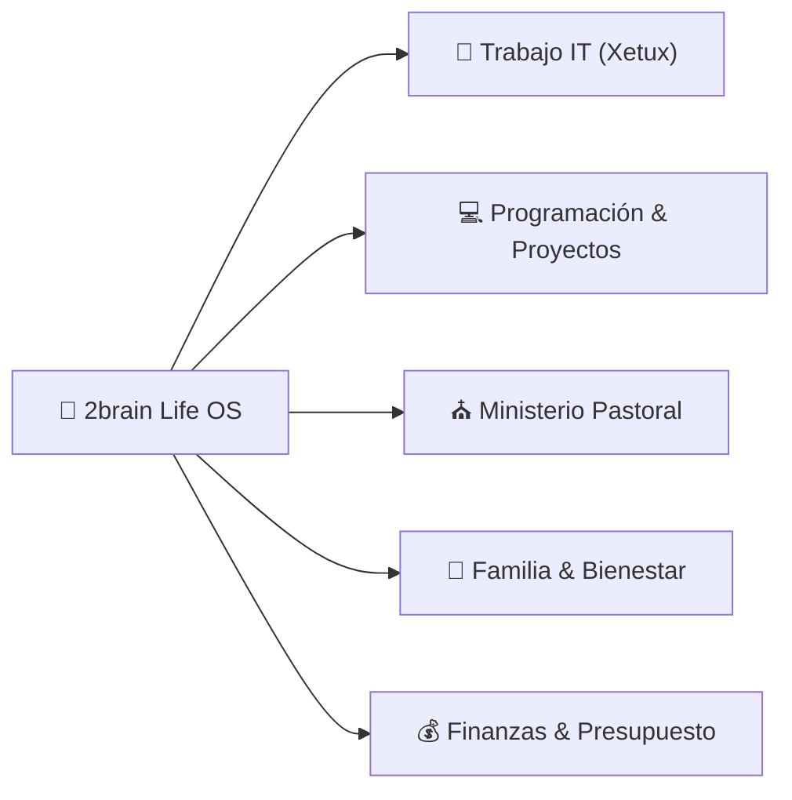

# 🚀 Dashboard de Vida & Centro de Control (Life OS)

*Cuadro de mando unificado para organizar, priorizar y ejecutar la vida laboral, ministerial, técnica, familiar y financiera.*

---

## 📅 Resumen de la Semana (Vista Ejecutiva)

---

## 🎯 Prioridades Activas por Área

### ⛪ 1. Area Ministerial (Pastorado)
- [x] Diseñar estructura de la nueva serie de discipulado: [[Serie de Sermones: Caminando Juntos - De Creyentes a Discípulos|ministerial/serie-discipulado-caminando-juntos.md]]
- [x] Estudio exegético del Sermón 1: [[Estudio Exegético y Homilético - Sermón 1: De la Multitud a la Mesa|ministerial/sermon-1-de-la-multitud-a-la-mesa-estudio.md]]
- [x] Estudio exegético del Sermón 2: [[Estudio Exegético y Homilético - Sermón 2: El Modelo del Maestro|ministerial/sermon-2-el-modelo-del-maestro-estudio.md]]
- [ ] **Agendado en Google Calendar Personal (17-Sep 12:30 – 13:30 PM)**: Lectura y meditación del [[Estudio Exegético y Homilético - Sermón 2: El Modelo del Maestro|ministerial/sermon-2-el-modelo-del-maestro-estudio.md]] durante el almuerzo.
- [x] Ingestar e integrar el [[Sistema de Productividad del Pastor-Ingeniero|ministerial/sistema-productividad-pastor-ingeniero.md]] ([Resumen Exec|summaries/manual-maestro-pastor-ingeniero.md]).
- [ ] **En Progreso**: Armar la predicación final del Sermón 1 para el domingo.
- [ ] **Próximo**: Preparar la guía de preguntas para grupos pequeños/células.

### 🏢 2. Area Trabajo (Analista IT & Soporte Xetux)
- [x] **Actualización de Tasa de Bs en Xetux (17-Sep)**: Tasa oficial actualizada correctamente a primera hora.
- [ ] **Agendado en Google Calendar Trabajo (17-Sep 09:00 – 09:30 AM)**: 📋 `[Q1] Pasar presupuesto de servidor MasterHub y costos de planes de IA` (Elaboración y entrega a las 09:00 AM).
- [ ] **Agendado en Google Calendar Trabajo (17-Sep 02:30 – 03:30 PM)**: 🔧 `[Q2] Configuración de Server NAS Marketing` (Pruebas de red, almacenamiento y accesos).
- [ ] **Agendado en Google Calendar Trabajo (17-Sep 03:30 – 04:00 PM)**: 📧 `[Q1] Enviar correo: Presupuesto de Redes y Movimiento de Rack` (Antes de las 5:00 PM).
- [ ] **Agendado en Google Calendar Trabajo (17-Sep 04:00 – 04:30 PM)**: 📧 `[Q1] Enviar correo: Presupuesto de Servidores MasterHub y Planes de IA` (Con enlace a Google Docs PROP-MGH-2026-004, antes de las 5:00 PM).
- [x] **Reunión de Dirección Ejecutiva**: Presentación aprobada por el Sr. Emiliano.
  - [x] Aprobada la contratación del **Soporte Técnico IT Jr. (Nivel 1)**.
  - [x] Aprobada la ejecución del **Módulo de Finanzas (`finance-ms`)** bajo **Plan B Exprés ($6,000 USD / 6 sem)**.
- [x] **Perfil de Cargo IT Jr.**: Creado y publicado en Google Docs corporativo con la plantilla *"Documento con Banner"*.
- [x] **Google Docs & Tasks MCP**: Servidores MCP multicuenta y Google Tasks API configurados y autenticados.
- [ ] **Agendado en Google Calendar Trabajo (18-Sep 04:00 PM – 05:00 PM)**: 🧪 `[Q1] QA Audit & Testing de TASK 2.2 y TASK 2.3 en MasterHub (Candidatos, CVs en S3 y Puente Candidato ➔ Empleado con 30 días de prueba)` (Ver informe en [[Informe Técnico: Entrega de Tasks 2.2 y 2.3 (MS-HR)|trabajo/informe-entrega-task-2.2-2.3-ms-hr.md]]).
- [x] **MasterHub (MS-HR) — TASK 2.2 & TASK 2.3 Entregadas (100%)**: Backend, Frontend, MinIO S3, REST APIs y modal UI probados y listos para QA.
- [ ] **Próximo (Toma de Turno)**: Iniciar el Modelado del **Sprint 1 de Finanzas (`finance-ms`)** (17/09 – 27/09 | CxP & Motor SENIAT).

### 💻 3. Area Programación & 🚀 Proyectos de Software
- [x] **WebCastro**: Auditoría de subagentes completada, migración Vercel corregida.
- [ ] **Agendado en Google Calendar Personal (17-Sep 09:00 – 11:00 AM)**: [[Proyecto: WebCastro|proyectos/webcastro.md]] — Configuración final de credenciales SMTP de Gmail en `.env` e integración.
- [x] **Time-blocking Deep Work Agendado en Google Calendar (`finance-ms`)**:
  - **Lunes a Viernes**: 08:30 PM – 10:30 PM (2 horas de trabajo enfocado nocturno).
  - **Sábados y Domingos**: 06:00 PM – 08:30 PM (2.5 horas de desarrollo intensivo).
- [x] **MasterHub (MS-HR)** — **TASK 2.2 Entregada (100%)**:
  - [x] Modelos Prisma `Candidate` & `Interview` en `hr-ms` con correlativo `candidatoNum` y *soft delete*.
  - [x] Endpoints REST en `api-gateway` y TCP en `hr-ms` con subida de CVs en PDF a MinIO (S3).
  - [x] Dashboard UI Next.js en `/dashboard/hr/candidates` con KPIs, filtros y Dropzone de CVs.
  - [x] Pruebas unitarias 36/36 pasadas y tarjeta actualizada a **Complete (Done)** en ClickUp.
- [x] **Regla de Autonomía de Subagentes**: Incorporada en `AGENTS.md` de MasterHub y `2brain`.

### 💰 4. Area Finanzas (Gestión Económica)
- [x] **Análisis de Gastos Reales del Cuaderno & Plan Conservador**: [[Informe Financiero Auditado: Gastos Reales del Cuaderno|finanzas/analisis-gastos-reales-cuaderno.md]] (Auditoría de gastos, plan de amortización gradual de deudas $408.07 USD en 4 meses con $120 USD/mes).
- [x] **Plan Financiero Estratégico 2026 elaborado con Subagente Finance Manager**: [[Plan Financiero Estratégico & Gestión de Presupuesto 2026|finanzas/plan-financiero-2026.md]] (Presupuesto operativo basado en $620 USD/mes reales).
- [x] **Clasificación de Ingresos `finance-ms` ($6,000.00 USD)**: [[Sprints & Backlog Scrum finance-ms|proyectos/sprints-modulo-finanzas.md]] (Registrado como *Proyección de Ingreso Extraordinario Futuro por Cobrar - Hitos Pendientes*).
- [x] **Balance & Reestructuración de Compras (Presupuesto 29,000 Bs.)**: Ingestado y categorizado en A/B/C ([voice_20260916_221908.md](file:///C:/Users/vmontoyaMG/Desktop/2brain/raw/inbox/voice_20260916_221908.md)).
- [ ] Control continuo de diezmos/ofrendas (10%), ahorro intocable ($62 USD/mes) y abono mensual de deudas ($120 USD/mes).

### 🏡 5. Area Familiar & Vida Personal
- [x] Establecer protocolo de **Madrugada Protegida** y **Desconexión Sagrada 18:30 - 20:30** (Cero pantallas).
- [x] Diseñar el [[Menú Semanal Nutritivo & Lista de Compras|familiar/menu-semanal-recetas-saludables.md]] ([Resumen Exec|summaries/recetas-menu-semanal.md]).
- [ ] Bloqueo de tiempo de calidad familiar en la agenda semanal.
- [ ] Hábito de salud, ejercicio y descanso espiritual.

---

## 🤖 Asistentes de Ejecución (Subagentes a tu Servicio)

- ⛪ Para predicas o consejería ➔ Usa **Pastoral Assistant** (`agents/pastoral_assistant.md`)
- 🛠️ Para tickets y manuales IT ➔ Usa **IT Support Expert** (`agents/it_support_expert.md`)
- 🎨 / ⚙️ Para avanzar proyectos de código ➔ Usa **Frontend UI Expert** o **Backend JS Expert**
- 💰 Para ajustar presupuestos ➔ Usa **Finance Manager** (`agents/finance_manager.md`)

---

## 🔗 Accesos Rápidos a la Wiki
- [[Índice Maestro|index.md]]
- [[Registro de Actividades|log.md]]
