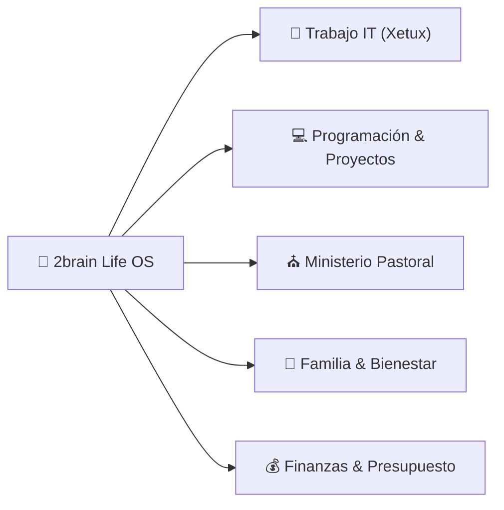

# 🚀 Dashboard de Vida & Centro de Control (Life OS)

*Cuadro de mando unificado para organizar, priorizar y ejecutar la vida laboral, ministerial, técnica, familiar y financiera.*

---

## 📅 Resumen de la Semana (Vista Ejecutiva)

---

## 🎯 Prioridades Activas por Área

### ⛪ 1. Area Ministerial (Pastorado)
- [x] Diseñar estructura de la nueva serie de discipulado: [[Serie de Sermones: Caminando Juntos - De Creyentes a Discípulos|ministerial/serie-discipulado-caminando-juntos.md]]
- [x] Estudio exegético del Sermón 1: [[Estudio Exegético y Homilético - Sermón 1: De la Multitud a la Mesa|ministerial/sermon-1-de-la-multitud-a-la-mesa-estudio.md]]
- [x] Ingestar e integrar el [[Sistema de Productividad del Pastor-Ingeniero|ministerial/sistema-productividad-pastor-ingeniero.md]] ([Resumen Exec|summaries/manual-maestro-pastor-ingeniero.md]).
- [ ] **En Progreso**: Armar la predicación final del Sermón 1 para el domingo.
- [ ] **Próximo**: Preparar la guía de preguntas para grupos pequeños/células.

### 🏢 2. Area Trabajo (Analista IT & Soporte Xetux)
- [x] **Agendado Evento 6:00 AM - 7:00 AM**: Informe de reunión con el jefe (`soporte@mastergroupve.com`).
- [x] **Registrada Task**: `[Xetux] Cambio de Tasa de Xetux` en ClickUp ([Ver Tarea](https://app.clickup.com/t/86bc1cxgv)).
- [ ] Revisión de tickets críticos de soporte en Xetux.
- [ ] Documentar SOPs (Procedimientos Operativos) de incidencias frecuentes en [[Área Trabajo - Analista IT y Soporte Xetux|trabajo/pilar-trabajo-xetux.md]].

### 💻 3. Area Programación & 🚀 Proyectos de Software
- [x] Auditoría y documentación de 7 proyectos en el Escritorio: [[Área Proyectos - Software Independiente|proyectos/pilar-proyectos.md]]
- [ ] **Sprints Pendientes**:
  - [x] [[Proyecto: Meniox|proyectos/meniox.md]] — Compilación exitosa del APK Release Android de GustFlow POS (`app-release.apk` 70.16 MB).
  - [ ] [[Proyecto: WebCastro|proyectos/webcastro.md]] — Botón de WhatsApp flotante, integración de correo y Optimización SEO / Metadatos completados.
  - [ ] [[Proyecto: Brotapp|proyectos/brotapp.md]] — Pruebas en emulador Android/iOS.
  - [ ] [[Proyecto: CRM-MG|proyectos/crm-mg.md]] — Pruebas de endpoints NestJS + OpenAI.
  - [x] **Masterhub (MS-HR)** — Completada Fase 2 Reclutamiento & Onboarding (Solicitudes de Vacantes) y librería `@masterhub/google-integration`.

### 💰 4. Area Finanzas (Gestión Económica)
- [ ] Actualizar hoja de presupuesto mensual (ingresos Xetux + proyectos freelance).
- [ ] Asignación de diezmos/ofrendas y fondo de ahorro familiar en [[Área Finanzas - Gestión Económica|finanzas/pilar-finanzas-personales.md]].

### 🏡 5. Area Familiar & Vida Personal
- [x] Establecer protocolo de **Madrugada Protegida** y **Desconexión Sagrada 18:30 - 20:30** (Cero pantallas).
- [x] Diseñar el [[Menú Semanal Nutritivo & Lista de Compras|familiar/menu-semanal-recetas-saludables.md]] ([Resumen Exec|summaries/recetas-menu-semanal.md]).
- [ ] Bloqueo de tiempo de calidad familiar en la agenda semanal.
- [ ] Hábito de salud, ejercicio y descanso espiritual.

---

## 🤖 Asistentes de Ejecución (Subagentes a tu Servicio)

- ⛪ Para predicas o consejería ➔ Usa **Pastoral Assistant** (`agents/pastoral_assistant.md`)
- 🛠️ Para tickets y manuales IT ➔ Usa **IT Support Expert** (`agents/it_support_expert.md`)
- 🎨 / ⚙️ Para avanzar proyectos de código ➔ Usa **Frontend UI Expert** o **Backend JS Expert**
- 💰 Para ajustar presupuestos ➔ Usa **Finance Manager** (`agents/finance_manager.md`)

---

## 🔗 Accesos Rápidos a la Wiki
- [[Índice Maestro|index.md]]
- [[Registro de Actividades|log.md]]
