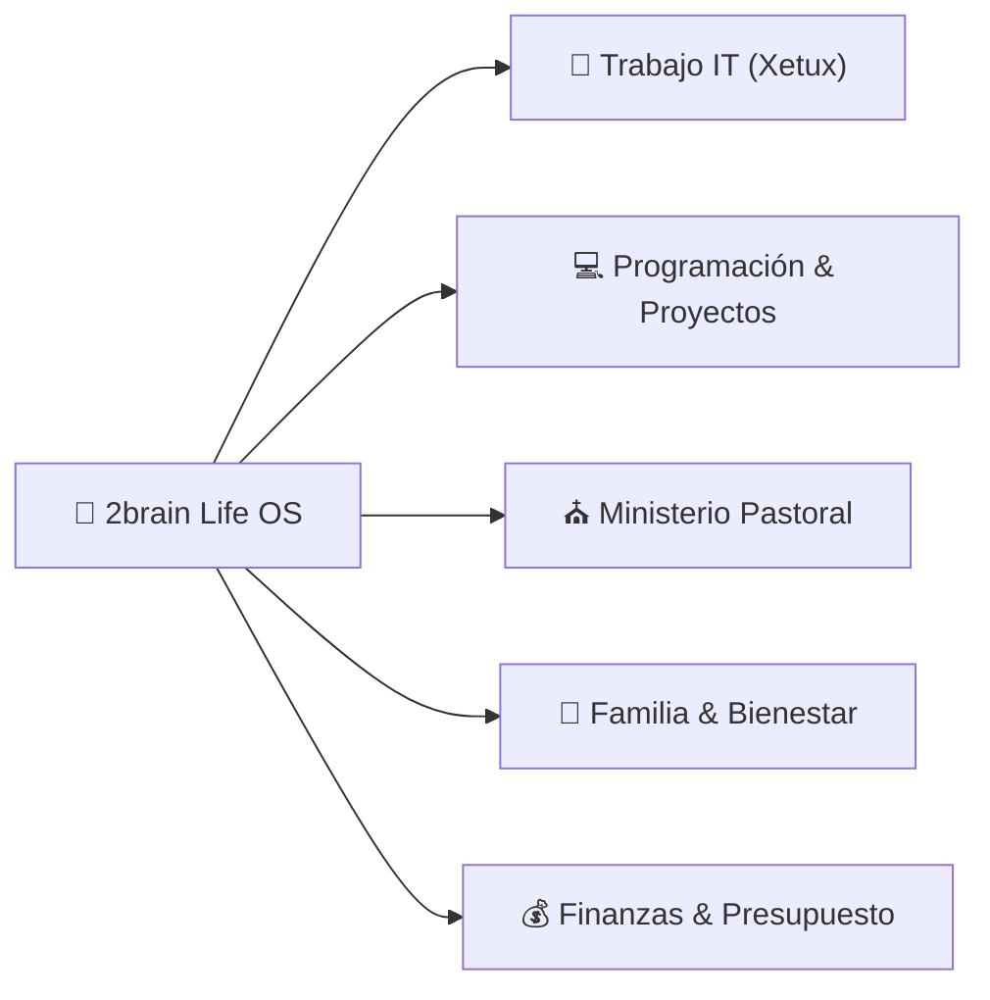

# 🚀 Dashboard de Vida & Centro de Control (Life OS)

*Cuadro de mando unificado para organizar, priorizar y ejecutar la vida laboral, ministerial, técnica, familiar y financiera.*

---

## 📅 Resumen de la Semana (Vista Ejecutiva)

---

## 🎯 Prioridades Activas por Área

### ⛪ 1. Area Ministerial (Pastorado)
- [x] Diseñar estructura de la nueva serie de discipulado: [[serie-discipulado-caminando-juntos|Serie de Sermones: Caminando Juntos - De Creyentes a Discípulos]]
- [x] Estudio exegético del Sermón 1: [[sermon-1-de-la-multitud-a-la-mesa-estudio|Estudio Exegético y Homilético - Sermón 1: De la Multitud a la Mesa]]
- [x] Estudio exegético del Sermón 2: [[sermon-2-el-modelo-del-maestro-estudio|Estudio Exegético y Homilético - Sermón 2: El Modelo del Maestro]]
- [ ] **Agendado en Google Calendar Personal (17-Sep 12:30 – 13:30 PM)**: Lectura y meditación del [[sermon-2-el-modelo-del-maestro-estudio|Estudio Exegético y Homilético - Sermón 2: El Modelo del Maestro]] durante el almuerzo.
- [x] Ingestar e integrar el [[sistema-productividad-pastor-ingeniero|Sistema de Productividad del Pastor-Ingeniero]] ([Resumen Exec|summaries/manual-maestro-pastor-ingeniero.md]).
- [ ] **En Progreso**: Armar la predicación final del Sermón 1 para el domingo.
- [ ] **Próximo**: Preparar la guía de preguntas para grupos pequeños/células.

### 🏢 2. Area Trabajo (Analista IT & Soporte Xetux / MasterHub)
- [x] **Ingesta y Auditoría de Reclutamiento RRHH**: Descargado y parseado el libro maestro de Control de Reclutamiento (1.996 entrevistas, 117 vacantes, matriz Head Count 2026).
- [x] **Despliegue Simultáneo de la Comunidad del Anillo (Vacantes & Head Count 2026)**:
  - [x] 🔮 **Galadriel**: Schema Prisma enriquecido (`code @unique`, `source`, `HeadCountPosition`) y seed de 114 vacantes y 255 posiciones de dotación en PostgreSQL Aiven Cloud (`hr_db`).
  - [x] ⛏️ **Gimli**: Módulo `HeadcountModule`, 8 patrones TCP, endpoints REST en `api-gateway`, correlativo `VAC-XXX` y regla de negocio defensiva por cupo disponible (`N <= 0`).
  - [x] 🏹 **Legolas**: Vistas `/dashboard/hr/vacancies` y `/dashboard/hr/headcount` con semáforo dinámico, modal drill-down de colaboradores instalados y botón `+ Abrir Vacante`.
  - [x] 💍 **Frodo**: Construcción y recreación de contenedores Docker en `localhost:3000` y `localhost:3001` (HTTP 200).
- [x] **Sincronización Git**: Cambios integrados y subidos al repositorio remoto del equipo (`team/main`).
- [ ] **Agendado en Google Calendar Trabajo (23-Sep 11:00 AM – 12:00 PM)**: 🧪 `[Q1] QA Test MS-HR: Tasks 2.2 y 2.3 (Candidatos, CVs S3 y Puente Onboarding)`.
- [ ] **Agendado en Google Calendar Trabajo (23-Sep 02:00 PM – 03:00 PM)**: 🧪 `[Q1] QA Test MS-HR: Vacantes Correlativas VAC-XXX y Matriz Head Count 2026`.
- [ ] **Próximo (Toma de Turno)**: Ejecución de las sesiones de QA agendadas y continuación con la integración de `@masterhub/google-integration` (Calendar & Gmail).

### 💻 3. Area Programación & 🚀 Proyectos de Software
- [x] **WebCastro**: Auditoría de subagentes completada, migración Vercel corregida.
- [ ] **Agendado en Google Calendar Personal (17-Sep 09:00 – 11:00 AM)**: [[webcastro|Proyecto: WebCastro]] — Configuración final de credenciales SMTP de Gmail en `.env` e integración.
- [x] **Time-blocking Deep Work Agendado en Google Calendar (`finance-ms`)**:
  - **Lunes a Viernes**: 08:30 PM – 10:30 PM (2 horas de trabajo enfocado nocturno).
  - **Sábados y Domingos**: 06:00 PM – 08:30 PM (2.5 horas de desarrollo intensivo).
- [x] **MasterHub (MS-HR)** — **TASK 2.2 Entregada (100%)**:
  - [x] Modelos Prisma `Candidate` & `Interview` en `hr-ms` con correlativo `candidatoNum` y *soft delete*.
  - [x] Endpoints REST en `api-gateway` y TCP en `hr-ms` con subida de CVs en PDF a MinIO (S3).
  - [x] Dashboard UI Next.js en `/dashboard/hr/candidates` con KPIs, filtros y Dropzone de CVs.
  - [x] Pruebas unitarias 36/36 pasadas y tarjeta actualizada a **Complete (Done)** en ClickUp.
- [x] **Regla de Autonomía de Subagentes**: Incorporada en `AGENTS.md` de MasterHub y `2brain`.

### 💰 4. Area Finanzas (Gestión Económica)
- [x] **Análisis de Gastos Reales del Cuaderno & Plan Conservador**: [[analisis-gastos-reales-cuaderno|Informe Financiero Auditado: Gastos Reales del Cuaderno]] (Auditoría de gastos, plan de amortización gradual de deudas $408.07 USD en 4 meses con $120 USD/mes).
- [x] **Plan Financiero Estratégico 2026 elaborado con Subagente Finance Manager**: [[plan-financiero-2026|Plan Financiero Estratégico & Gestión de Presupuesto 2026]] (Presupuesto operativo basado en $620 USD/mes reales).
- [x] **Clasificación de Ingresos `finance-ms` ($6,000.00 USD)**: [[sprints-modulo-finanzas|Sprints & Backlog Scrum finance-ms]] (Registrado como *Proyección de Ingreso Extraordinario Futuro por Cobrar - Hitos Pendientes*).
- [x] **Balance & Reestructuración de Compras (Presupuesto 29,000 Bs.)**: Ingestado y categorizado en A/B/C ([voice_20260916_221908.md](file:///C:/Users/vmontoyaMG/Desktop/2brain/raw/inbox/voice_20260916_221908.md)).
- [ ] Control continuo de diezmos/ofrendas (10%), ahorro intocable ($62 USD/mes) y abono mensual de deudas ($120 USD/mes).

### 🏡 5. Area Familiar & Vida Personal
- [x] Establecer protocolo de **Madrugada Protegida** y **Desconexión Sagrada 18:30 - 20:30** (Cero pantallas).
- [x] Diseñar el [[menu-semanal-recetas-saludables|Menú Semanal Nutritivo & Lista de Compras]] ([Resumen Exec|summaries/recetas-menu-semanal.md]).
- [ ] Bloqueo de tiempo de calidad familiar en la agenda semanal.
- [ ] Hábito de salud, ejercicio y descanso espiritual.

---

## 🤖 Asistentes de Ejecución (Subagentes a tu Servicio)

- ⛪ Para predicas o consejería ➔ Usa **Pastoral Assistant** (`agents/pastoral_assistant.md`)
- 🛠️ Para tickets y manuales IT ➔ Usa **IT Support Expert** (`agents/it_support_expert.md`)
- 🎨 / ⚙️ Para avanzar proyectos de código ➔ Usa **Frontend UI Expert** o **Backend JS Expert**
- 💰 Para ajustar presupuestos ➔ Usa **Finance Manager** (`agents/finance_manager.md`)

---

## 🔗 Accesos Rápidos a la Wiki
- [[index|Índice Maestro]]
- [[log|Registro de Actividades]]
