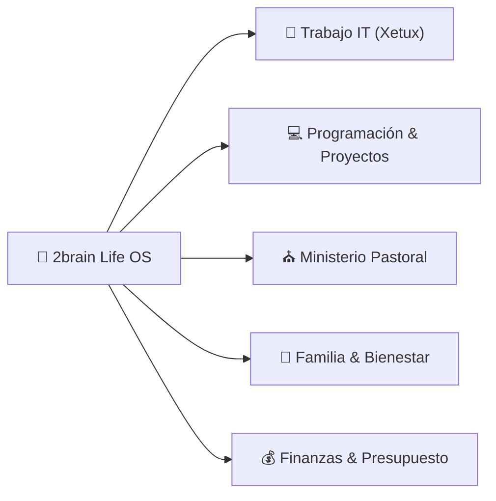

# 🚀 Dashboard de Vida & Centro de Control (Life OS)

*Cuadro de mando unificado para organizar, priorizar y ejecutar la vida laboral, ministerial, técnica, familiar y financiera.*

---

## 📅 Resumen de la Semana (Vista Ejecutiva)

---

## 🎯 Prioridades Activas por Área

### ⛪ 1. Area Ministerial (Pastorado)
- [x] Diseñar estructura de la nueva serie de discipulado: [[Serie de Sermones: Caminando Juntos - De Creyentes a Discípulos|ministerial/serie-discipulado-caminando-juntos.md]]
- [x] Estudio exegético del Sermón 1: [[Estudio Exegético y Homilético - Sermón 1: De la Multitud a la Mesa|ministerial/sermon-1-de-la-multitud-a-la-mesa-estudio.md]]
- [x] Ingestar e integrar el [[Sistema de Productividad del Pastor-Ingeniero|ministerial/sistema-productividad-pastor-ingeniero.md]] ([Resumen Exec|summaries/manual-maestro-pastor-ingeniero.md]).
- [ ] **En Progreso**: Armar la predicación final del Sermón 1 para el domingo.
- [ ] **Próximo**: Preparar la guía de preguntas para grupos pequeños/células.

### 🏢 2. Area Trabajo (Analista IT & Soporte Xetux)
- [x] **Reunión de Dirección Ejecutiva**: Presentación aprobada por el Sr. Emiliano.
  - [x] Aprobada la contratación del **Soporte Técnico IT Jr. (Nivel 1)**.
  - [x] Aprobada la ejecución del **Módulo de Finanzas (`finance-ms`)**.
- [x] **Perfil de Cargo IT Jr.**: Creado y publicado en Google Docs corporativo con la plantilla *"Documento con Banner"*.
- [x] **Google Docs MCP**: Servidores MCP multicuenta (`google-docs-trabajo` y `google-docs-personal`) configurados y autenticados.
- [ ] **Próximo (Toma de Turno)**: Iniciar el Modelado del **Sprint 1 de Finanzas (`finance-ms`)** (CxP & Motor SENIAT).

### 💻 3. Area Programación & 🚀 Proyectos de Software
- [x] **MasterHub (MS-HR)** — **TASK 2.2 Entregada (100%)**:
  - [x] Modelos Prisma `Candidate` & `Interview` en `hr-ms` con correlativo `candidatoNum` y *soft delete*.
  - [x] Endpoints REST en `api-gateway` y TCP en `hr-ms` con subida de CVs en PDF a MinIO (S3).
  - [x] Dashboard UI Next.js en `/dashboard/hr/candidates` con KPIs, filtros y Dropzone de CVs.
  - [x] Pruebas unitarias 36/36 pasadas y tarjeta actualizada a **Complete (Done)** en ClickUp.
- [x] **Regla de Autonomía de Subagentes**: Incorporada en `AGENTS.md` de MasterHub y `2brain`.

### 💰 4. Area Finanzas (Gestión Económica)
- [ ] Actualizar hoja de presupuesto mensual (ingresos Xetux + proyectos freelance).
- [ ] Asignación de diezmos/ofrendas y fondo de ahorro familiar en [[Área Finanzas - Gestión Económica|finanzas/pilar-finanzas-personales.md]].

### 🏡 5. Area Familiar & Vida Personal
- [x] Establecer protocolo de **Madrugada Protegida** y **Desconexión Sagrada 18:30 - 20:30** (Cero pantallas).
- [x] Diseñar el [[Menú Semanal Nutritivo & Lista de Compras|familiar/menu-semanal-recetas-saludables.md]] ([Resumen Exec|summaries/recetas-menu-semanal.md]).
- [ ] Bloqueo de tiempo de calidad familiar en la agenda semanal.
- [ ] Hábito de salud, ejercicio y descanso espiritual.

---

## 🤖 Asistentes de Ejecución (Subagentes a tu Servicio)

- ⛪ Para predicas o consejería ➔ Usa **Pastoral Assistant** (`agents/pastoral_assistant.md`)
- 🛠️ Para tickets y manuales IT ➔ Usa **IT Support Expert** (`agents/it_support_expert.md`)
- 🎨 / ⚙️ Para avanzar proyectos de código ➔ Usa **Frontend UI Expert** o **Backend JS Expert**
- 💰 Para ajustar presupuestos ➔ Usa **Finance Manager** (`agents/finance_manager.md`)

---

## 🔗 Accesos Rápidos a la Wiki
- [[Índice Maestro|index.md]]
- [[Registro de Actividades|log.md]]
