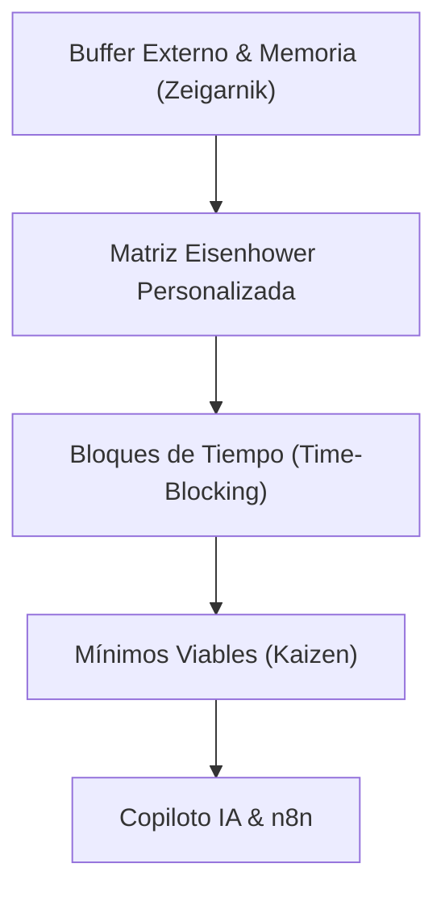

# Sistema de Productividad del Pastor-Ingeniero (24/7 Life OS)

**Área**: ⛪ Ministerial & 💻 Programación / 🏢 Trabajo  
**Subárea**: Arquitectura de Vida y Sistemas de Rendimiento  
**Documento Origen**: [manual-maestro-pastor-ingeniero.md](file:///C:/Users/vmontoyaMG/Desktop/2brain/raw/ministerial/manual-maestro-pastor-ingeniero.md)  
**Resumen**: [manual-maestro-pastor-ingeniero.md](file:///C:/Users/vmontoyaMG/Desktop/2brain/wiki/summaries/manual-maestro-pastor-ingeniero.md)

---

## 📌 Arquitectura General del Sistema

El **Pastor-Ingeniero** opera bajo una doble responsabilidad de alto impacto: la gestión de infraestructura de software/sistemas en **Xetux** y proyectos independientes (**Masterhub**, **CRM del jefe**, **Web Constructora**), combinada con el pastoreo, teología y consejería congregacional.

Para evitar la entropía y el desgaste biológico, la productividad se estructura no como una lista de tareas, sino como un **Sistema Operativo Unificado** basado en 5 pilares:

---

## 1. Clasificación de Carga de Trabajo (Eisenhower 2brain)

- **C1 (Urgente / Importante)**: Caídas de producción Xetux, hospitalizaciones de miembros congregacionales.
- **C2 (Importante / No Urgente) [Motor de Vida]**:
  - *Desarrollo de Software*: App Masterhub, CRM del jefe, Web Constructora.
  - *Ministerio*: Preparación exegética de sermones, discipulado de líderes.
  - *Personal/Familiar*: Devocional en pareja, entrenamiento físico, tiempo de calidad.
- **C3 (Urgente / No Importante)**: Automatizado vía n8n (inventarios de hardware, triaje de correos de soporte rutinario).
- **C4 (Eliminar)**: Consumo pasivo en redes, decisiones triviales repetitivas.

---

## 2. Horario Protocolar Semanal

| Horario | Bloque de Trabajo | Enfoque & Reglas |
| :--- | :--- | :--- |
| **05:00 - 06:00** | Madrugada Protegida & Espiritual | Ducha fría + Devocional individual |
| **06:00 - 07:00** | Mantenimiento Biológico | Ejercicio de alta densidad |
| **07:00 - 08:00** | Conexión Familiar | Desayuno y oración en pareja (**Sin Pantallas**) |
| **08:30 - 10:30** | **DEEP WORK A1** | Desarrollo Masterhub / Lógica compleja (Modo Avión) |
| **10:30 - 12:30** | Soporte & Operaciones IT | Xetux soporte, inventarios y correos (C3 controlado) |
| **12:30 - 13:30** | Restablecimiento Cognitivo | Almuerzo + Siesta de 15 minutos |
| **13:30 - 15:30** | **DEEP WORK A2** | Masterhub / Arquitectura de software |
| **17:00 - 18:30** | Bloque Rotativo | L/M/V: CRM Jefe & Web Constructora \| M/J: Sermones |
| **18:30 - 20:30** | Desconexión Sagrada | Tiempo con familia y hogar |
| **21:00 - 21:15** | Cierre Nocturno | Vaciado mental y prioridad A1 de mañana |

---

## 3. Integración tecnológica con ALFRED & n8n

1. **Telegram Voice Capture**: Envío de notas de voz -> Transcripción -> Etiquetado C1/C2/C3 en 2brain / Todoist.
2. **Accountability Bot**: Auditoría automática de devocionales y tiempo familiar.
3. **Sincronización Git 2brain**: Respaldo automático de la base de conocimiento en múltiples dispositivos.

---

## 🔗 Referencias Cruzadas
- [life-dashboard.md](file:///C:/Users/vmontoyaMG/Desktop/2brain/wiki/life-dashboard.md)
- [pilar-ministerial-pastorado.md](file:///C:/Users/vmontoyaMG/Desktop/2brain/wiki/ministerial/pilar-ministerial-pastorado.md)
- [roadmap-alfred-2brain-2026.md](file:///C:/Users/vmontoyaMG/Desktop/2brain/wiki/roadmap-alfred-2brain-2026.md)
