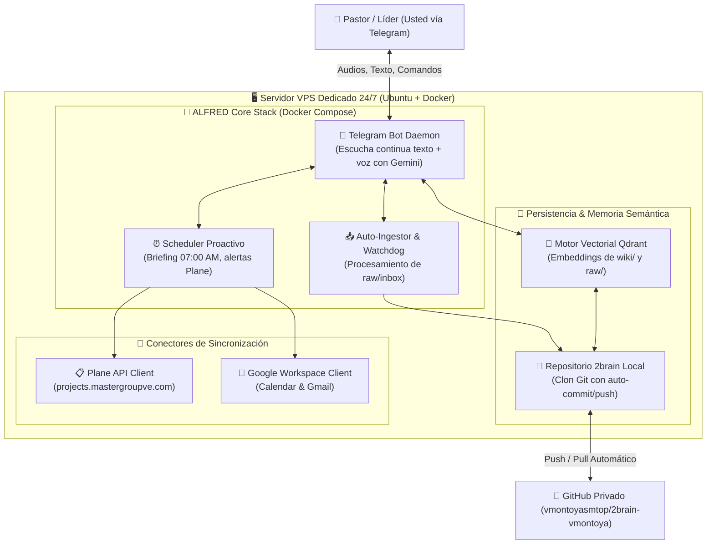

# 🖥️ Arquitectura & Despliegue Cloud VPS: ALFRED 2brain 24/7
### *Ecosistema Autónomo con Persistencia Local, Memoria Vectorial y Bot de Telegram Multimodal*

---

## 🎯 1. Visión Estratégica: De Asistente Local a Life OS Autónomo

Hasta la fecha, **ALFRED** ha operado con alta eficiencia en dos modalidades:
1. **Modo Local en PC (Polling):** Ejecutando `python scripts/telegram_bot.py` desde el equipo de la oficina (`vmontoyaMG`) o el de la casa (`vmont`). Requiere que la computadora permanezca encendida.
2. **Modo Serverless Efímero (Cloudflare Worker):** Respuestas rápidas a costo cero, pero sin sistema de archivos real, sin memoria semántica persistente y limitado a peticiones HTTP.

**El Salto Cualitativo:**  
Montar a ALFRED en un **Servidor Cloud VPS dedicado con Docker** proporciona un entorno de ejecución continuo, con disco duro permanente para clonar y sincronizar [2brain](file:///C:/Users/vmont/OneDrive/Desktop/2brain-vmontoya), base de datos vectorial para consultas profundas a la wiki, ingesta pesada de notas de voz/documentos y cron jobs proactivos.

---

## 🏛️ 2. Diagrama de Arquitectura del Sistema



---

## 💎 3. Capacidades Clave del Entorno en Servidor ("Hacerlo Bien")

### A. Memoria Semántica & RAG Vectorial (Búsqueda Inteligente)
* **Indexación Automática:** Cada nota de sermón en `wiki/ministerial/`, minuta de Xetux en `wiki/trabajo/`, requerimiento de MasterHub en `wiki/proyectos/` y finanzas en `wiki/finanzas/` se vectoriza mediante embeddings de Google.
* **Consultas Semánticas en Lenguaje Natural:** En lugar de depender de palabras clave exactas, usted puede enviar un audio o mensaje en Telegram preguntando:
  - *«Alfred, ¿qué acuerdos tomamos sobre los contratos de TI en la última reunión?»*
  - *«Alfred, rescátame los pasajes y aplicaciones que estudiamos sobre el estrés y la soberanía de Dios.»*
  ALFRED recupera los fragmentos exactos de su Segundo Cerebro y genera una síntesis precisa citando la nota fuente.

### B. Ingesta Multimodal Pesada (Notas de Voz & Documentos)
* Soporte para audios largos (5 a 15 minutos) grabados desde el vehículo o en trayectos.
* Transcripción vía Gemini Multimodal con extracción de:
  - Tareas accionables (para enviarlas a Plane o al Life Dashboard).
  - Resumen ejecutivo estructurado.
  - Creación automática de archivo Markdown en `raw/inbox/` y posterior clasificación.

### C. Proactividad Autónoma (Sin interacción previa)
* **07:00 AM — Briefing Matutino:** Notificación push a Telegram con:
  - Sprints y tareas activas en Plane (`projects.mastergroupve.com`).
  - Eventos de Google Calendar (personal y laboral).
  - Píldora de calibración devocional / espiritual del día.
* **21:00 PM — Check-in de Cierre de Jornada:** Balance de lo ejecutado y sincronización preventiva de estado.

---

## 💰 4. Análisis Comparativo de Proveedores Cloud

| Proveedor | Modelo Recomendado | Specs (vCPU / RAM / Disco) | Coste Mensual | Evaluación Estratégica |
| :--- | :--- | :--- | :--- | :--- |
| 🇩🇪 **Hetzner Cloud** | **CX22 / CPX21** | 2 vCPU, 4 GB RAM, 40 GB NVMe | **~€4.50 – €7.00 / mes** | 🏆 **Opción #1 Recomendada.** Insuperable relación precio/calidad, discos ultrarrápidos NVMe y datacenter de alta confiabilidad. |
| 🏢 **Infraestructura MasterGroup** | Contenedor en VPS Linode existente | Recursos compartidos en Docker | **$0 extra** | Excelente si se cuenta con margen de RAM/CPU en el nodo de Linode existente (`172.238.221.116`). |
| 🛡️ **Oracle Cloud Free Tier** | VM.Standard.A1.Flex | 4 OCPU ARM, 24 GB RAM, 200 GB | **$0 / mes (Gratis de por vida)** | Potencia extraordinaria a costo cero; requiere registro con tarjeta de crédito bancaria válida. |
| 🌊 **DigitalOcean / Linode** | Basic Droplet / Shared Linode | 1-2 vCPU, 2 GB RAM, 50 GB SSD | **$12.00 / mes** | Estable y maduro, pero sensiblemente más costoso que Hetzner por menos recursos. |

---

## 📦 5. Especificación de Despliegue: `docker-compose.yml`

Estructura de referencia para inicializar el stack completo en `/opt/alfred-2brain`:

```yaml
version: '3.8'

services:
  # 1. Daemon Principal de ALFRED (Telegram Bot + Gemini + Auto-Ingest)
  alfred-daemon:
    build:
      context: .
      dockerfile: Dockerfile
    container_name: alfred-daemon
    restart: unless-stopped
    volumes:
      - /opt/alfred-2brain/repo:/app/2brain
      - /opt/alfred-2brain/data:/app/data
      - ~/.ssh:/root/.ssh:ro
    environment:
      - TELEGRAM_BOT_TOKEN=${TELEGRAM_BOT_TOKEN}
      - GEMINI_API_KEY=${GEMINI_API_KEY}
      - TELEGRAM_ALLOWED_USERS=${TELEGRAM_ALLOWED_USERS}
      - PLANE_API_KEY=${PLANE_API_KEY}
      - QDRANT_HOST=vector-db
      - QDRANT_PORT=6333
    depends_on:
      - vector-db

  # 2. Base de Datos Vectorial para Memoria RAG Semántica
  vector-db:
    image: qdrant/qdrant:latest
    container_name: alfred-vector-db
    restart: unless-stopped
    volumes:
      - /opt/alfred-2brain/qdrant_storage:/qdrant/storage
    ports:
      - "127.0.0.1:6333:6333"

  # 3. Demonio de Sincronización Automática con GitHub
  git-sync:
    image: alpine/git:latest
    container_name: alfred-git-sync
    restart: unless-stopped
    volumes:
      - /opt/alfred-2brain/repo:/repo
      - ~/.ssh:/root/.ssh:ro
    entrypoint: |
      sh -c '
      while true; do
        cd /repo
        git fetch origin master
        if [ -n "$$(git status --porcelain)" ]; then
          git add .
          git commit -m "chore(auto-sync): sincronización proactiva cloud [skip ci]"
          git push origin master
        fi
        git pull origin master --rebase
        sleep 300
      done'
```

---

## 🚀 6. Pasos para la Puesta en Marcha (Runbook de Despliegue)

1. **Aprovisionar el Servidor:** Instalar Ubuntu Server (22.04 LTS o 24.04 LTS) y configurar Docker Engine + Docker Compose Plugin.
2. **Generar Llave SSH del Servidor:**
   ```bash
   ssh-keygen -t ed25519 -C "alfred-cloud-vps"
   cat ~/.ssh/id_ed25519.pub
   ```
   Agregar la clave como *Deploy Key* (con permisos de escritura) en el repositorio `vmontoyasmtop/2brain-vmontoya`.
3. **Clonar el Repositorio en `/opt/alfred-2brain/repo`:**
   ```bash
   git clone git@github.com:vmontoyasmtop/2brain-vmontoya.git /opt/alfred-2brain/repo
   ```
4. **Configurar el archivo de variables `.env`:**
   ```bash
   TELEGRAM_BOT_TOKEN="tu_token_aqui"
   GEMINI_API_KEY="tu_llave_aqui"
   TELEGRAM_ALLOWED_USERS="tu_chat_id"
   PLANE_API_KEY="plane_api_88d0adde65f14ab78a403bc61fe01449"
   ```
5. **Iniciar el Ecosistema:**
   ```bash
   docker compose up -d
   ```

---

## 🔗 Documentos Relacionados
- [[roadmap-alfred-2brain-2026|Roadmap de Evolución: ALFRED & Sistema 2brain 2026]]
- [[life-dashboard|Dashboard de Vida & Centro de Control]]
- [[plane-gestion-proyectos|Plane: Gestión de Proyectos]]
- [[pilar-proyectos|Pilar de Proyectos de Software]]
