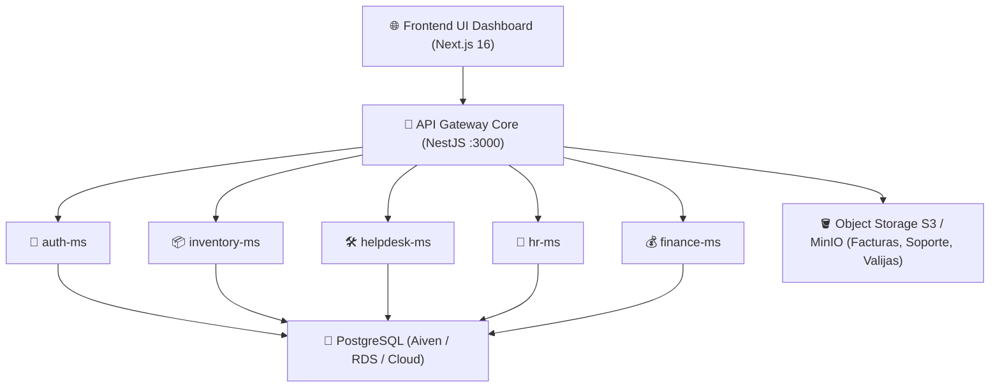

# ☁️ Estudio Comparativo de Infraestructura Cloud para MasterHub (MGH)

**Proyecto**: MasterHub (MGH) — Plataforma Multimicroservicio & PostgreSQL  
**Área**: 🚀 `proyectos` & 💻 `programacion`  
**Autor**: ALFRED (2brain System)  
**Fecha**: Septiembre 2026  

---

## 📌 1. Visión General del Footprint de MasterHub (MGH)

Para dimensionar el costo y funcionalidad de la nube, la arquitectura de **MasterHub (MGH)** comprende los siguientes componentes:

### Componentes Activos a Desplegar:
1. **7 Contenedores Docker / Microservicios**:
   - `frontend-ui-dashboard` (Next.js 16)
   - `api-gateway` (NestJS Gateway REST)
   - `auth-ms`, `inventory-ms`, `helpdesk-ms`, `hr-ms`, `finance-ms` (Microservicios NestJS)
2. **Bases de Datos Relacionales (PostgreSQL)**:
   - DBs aisladas (`auth_db`, `inventory_db`, `helpdesk_db`, `hr_db`, `finance_db`).
3. **Almacenamiento de Archivos (Object Storage Compatible con S3)**:
   - Para PDF de facturas, retenciones SENIAT y valijas digitales.

---

## 📊 2. Análisis Comparativo de 4 Proveedores Cloud

---

### 🔹 Opción 1: Híbrido PaaS (Render / Railway + Aiven Cloud DB + Cloudflare)
*La opción más rápida y de cero administración de servidores.*

* **Microservicios**: Railway / Render (Despliegue directo vía GitHub con Docker / Docker Compose).
* **Base de Datos**: Aiven Cloud PostgreSQL (Clusters gestionados con SSL, SSL Mode Require y backups diarios).
* **Storage S3**: Cloudflare R2 / Supabase Storage ($0 de egress / transferencia de datos).
* **Pros**:
  - Configuración e integración continua (CI/CD) en 5 minutos.
  - Cero gestión de Linux / parches de seguridad.
  - Escalado de microservicios con 1 clic.
* **Contras**: Costo por RAM consumida si todos los 7 contenedores corren 24/7 sin sleep.
* **Estimado Mensual**: **$35.00 – $65.00 USD / mes**

---

### 🚀 Opción 2: Hetzner Cloud + Coolify / Docker Swarm (Máximo Rendimiento / Menor Costo)
*La opción preferida para maximizar el presupuesto con hardware dedicado de alto rendimiento.*

* **Servidor VPS**: VPS Hetzner Cloud (Ej: **CPX31** en EE.UU. o Alemania — 4 vCPU AMD EPYC, 8 GB RAM, 160 GB NVMe).
* **Orquestador**: **Coolify** (PaaS Open-Source auto-hospedado) o Docker Compose con SSL automático Caddy.
* **Base de Datos**: PostgreSQL en el mismo VPS o Aiven Cloud PostgreSQL.
* **Storage S3**: Hetzner Object Storage ($5/mes por 1 TB) o MinIO local.
* **Pros**:
  - **Relación Precio/Potencia imbatible**: Todo MasterHub corre con holgura en 1 sola máquina por un precio fijo.
  - Incluye CPU AMD EPYC dedicada y almacenamiento ultrarrápido NVMe.
  - Cero sorpresa en la factura mensual.
* **Contras**: Requiere configuración inicial del VPS y backups automatizados.
* **Estimado Mensual**: **$15.00 – $25.00 USD / mes**

---

### 🏢 Opción 3: DigitalOcean (App Platform + Managed PostgreSQL + Spaces)
*El estándar de simplicidad corporativa para desarrolladores.*

* **Microservicios**: DigitalOcean App Platform (Contenedores Docker administrados).
* **Base de Datos**: DigitalOcean Managed Databases (PostgreSQL 15+ con Standby node opcional).
* **Storage S3**: DigitalOcean Spaces ($5/mes por 250 GB + CDN global).
* **Pros**:
  - Panel visual intuitivo y excelente soporte para Next.js y NestJS.
  - SSL automático, métricas visuales de uso de RAM/CPU y logs unificados.
  - Integración transparente con GitHub.
* **Contras**: El costo escala al agregar múltiples contenedores individuales.
* **Estimado Mensual**: **$48.00 – $85.00 USD / mes**

---

### ☁️ Opción 4: AWS (Amazon Web Services — App Runner / ECS Fargate + RDS + S3)
*El gigante corporativo para máxima disponibilidad y prestigio.*

* **Microservicios**: AWS App Runner (Serverless para API Gateway y Next.js) o ECS Fargate.
* **Base de Datos**: AWS RDS PostgreSQL (db.t4g.micro / db.t4g.small) o Aiven Cloud.
* **Storage S3**: Amazon S3 Standard.
* **Pros**:
  - Disponibilidad 99.99% y cumplimiento estricto de estándares globales.
  - Infraestructura corporativa de máxima confianza para grandes clientes.
* **Contras**: Curva de aprendizaje compleja (IAM, VPCs, Security Groups) y costos ocultos por tráfico saliente (bandwidth egress).
* **Estimado Mensual**: **$70.00 – $130.00 USD / mes**

---

## 📈 3. Cuadro Comparativo Global de Precios y Funcionalidades

| Criterio / Proveedor | 1. Híbrido PaaS (Railway + Aiven) | 2. Hetzner + Coolify 🏆 | 3. DigitalOcean | 4. AWS (App Runner/RDS) |
| :--- | :---: | :---: | :---: | :---: |
| **Costo Mensual Estimado** | **$35 – $65 USD** | **$15 – $25 USD** | **$48 – $85 USD** | **$70 – $130 USD** |
| **Costo Anual (USD)** | $420 – $780 USD | **$180 – $300 USD** | $576 – $1,020 USD | $840 – $1,560 USD |
| **Dificultad de Despliegue** | Baja (Muy fácil) | Media (Fácil con Coolify) | Baja | Alta |
| **Soporte Docker Multi-MS** | Excelente | Excelente | Bueno | Excelente |
| **Desempeño CPU / RAM** | Compartido | **Dedicado NVMe AMD** | Compartido | Serverless |
| **Control de Costos** | Predecible | **100% Fijo** | Predecible | Variable por Egress |

---

## 🎯 4. Recomendación Estratégica de ALFRED para MasterHub

### 🥇 Recomendación Principal: **Opción 2 (Hetzner Cloud + Coolify)**
- **¿Por qué?**: Por solo **~$18 - $22 USD/mes**, un VPS **CPX31** en Hetzner (4 vCPU, 8 GB RAM, NVMe) puede hospedar holgadamente **los 7 microservicios de MasterHub**, MinIO y mantener una respuesta ultrarrápida.
- Con **Coolify** (que es como tener un "Vercel / Render personal" en su servidor), despliega cada commit de GitHub de forma automática con SSL/HTTPS gratis.

### 🥈 Segunda Opción Recomendada: **Opción 1 (Railway / Render + Aiven DB)**
- Si prefiere cero administración de VPS y que todo sea 100% Serverless/PaaS gestionado, mantener **Aiven Cloud para la DB** + **Railway/Render para los microservicios** ofrece un balance ideal por **~$45 USD/mes**.
