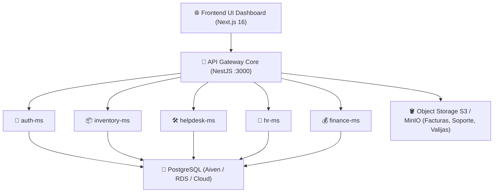

# ☁️ Estudio Comparativo de Infraestructura Cloud para MasterHub (MGH)

**Proyecto**: MasterHub (MGH) — Plataforma Multimicroservicio & PostgreSQL  
**Área**: 🚀 `proyectos` & 💻 `programacion`  
**Autor**: ALFRED (2brain System)  
**Auditoría de Precios**: Verificada en vivo (Septiembre 2026)  

---

## 📌 1. Visión General del Footprint de MasterHub (MGH)

Para dimensionar el costo y funcionalidad de la nube, la arquitectura de **MasterHub (MGH)** comprende los siguientes componentes:

---

## 📊 2. Análisis Comparativo de Proveedores Cloud (Precios Oficiales 2026)

### 🚀 Opción 1: Hetzner Cloud + Coolify / Docker (Máximo Rendimiento / Menor Costo) 🏆
* **Instancia Recomendada A (ARM Ampere CAX21)**: 4 vCPU ARM, 8 GB RAM, 80 GB NVMe -> **€7.99 / mes (~$8.50 USD/mes)**.
* **Instancia Recomendada B (AMD EPYC CPX22)**: 3 vCPU AMD EPYC, 4 GB RAM, 80 GB NVMe -> **€19.49 / mes (~$21.00 USD/mes)**.
* **Orquestador**: **Coolify** (PaaS Open-Source auto-hospedado) con SSL Caddy.
* **Estimado Mensual**: **$8.50 – $21.00 USD / mes**

---

### 🟢 Opción 2: SeeNode Cloud (`https://seenode.com/es`) 🚀
*La opción PaaS gestionada con integración nativa a servidor MCP para despliegue desde IA.*

* **Especificación**: 7 Contenedores (2 x Plan Estándar $7 + 5 x Plan Básico $4) + PostgreSQL Managed DB ($12) + S3 Storage ($2.50).
* **Pros**: Despliegue PaaS 100% gestionado en español, integración con MCP para IA, 7 días de prueba sin tarjeta.
* **Estimado Mensual**: **$48.50 USD / mes**

---

### 🔹 Opción 3: Híbrido PaaS (Railway / Render + Aiven Cloud DB)
* **Estimado Mensual**: **$35.00 – $65.00 USD / mes**

---

### 🏢 Opción 4: DigitalOcean (App Platform + Managed DB)
* **Estimado Mensual**: **$48.00 – $85.00 USD / mes**

---

### ☁️ Opción 5: AWS (App Runner / ECS Fargate + RDS)
* **Estimado Mensual**: **$70.00 – $130.00 USD / mes**

---

## 📈 3. Cuadro Comparativo Global Auditado

| Criterio / Proveedor | 1. Hetzner + Coolify 🏆 | 2. SeeNode Cloud 🚀 | 3. Híbrido PaaS (Railway/Aiven) | 4. DigitalOcean | 5. AWS (App Runner/RDS) |
| :--- | :---: | :---: | :---: | :---: | :---: |
| **Costo Mensual Verificado** | **$8.50 – $21.00 USD** | **$48.50 USD** | $35.00 – $65.00 USD | $48.00 – $85.00 USD | $70.00 – $130.00 USD |
| **Costo Anual (USD)** | **$102 – $252 USD** | **$582 USD** | $420 – $780 USD | $576 – $1,020 USD | $840 – $1,560 USD |
| **Integración MCP para IA** | Manual (vía SSH) | **Nativa con servidor MCP** | No disponible | No disponible | No disponible |
| **Control de Costos** | **100% Fijo** | **Créditos Fijos** | Predecible | Predecible | Variable por Egress |
| **Gestión** | Auto-hospedado | **100% Gestionado PaaS** | 100% Gestionado | 100% Gestionado | Gestionado |
