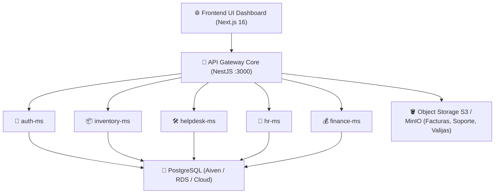

# ☁️ Estudio Comparativo de Infraestructura Cloud para MasterHub (MGH)

**Proyecto**: MasterHub (MGH) — Plataforma Multimicroservicio & PostgreSQL  
**Área**: 🚀 `proyectos` & 💻 `programacion`  
**Autor**: ALFRED (2brain System)  
**Auditoría de Precios**: Verificada en vivo (Septiembre 2026)  

---

## 📌 1. Visión General del Footprint de MasterHub (MGH)

Para dimensionar el costo y funcionalidad de la nube, la arquitectura de **MasterHub (MGH)** comprende los siguientes componentes:

---

## 📊 2. Análisis Comparativo de Proveedores Cloud (Precios Oficiales 2026)

### 🚀 Opción 1: Hetzner Cloud + Coolify / Docker (Máximo Rendimiento / Menor Costo) 🏆
*La opción recomendada para maximizar el presupuesto con hardware dedicado o de alto rendimiento.*

* **Instancia Recomendada A (ARM Ampere CAX21)**: 4 vCPU ARM, 8 GB RAM, 80 GB NVMe -> **€7.99 / mes (~$8.50 USD/mes)**.
* **Instancia Recomendada B (AMD EPYC CPX22)**: 3 vCPU AMD EPYC, 4 GB RAM, 80 GB NVMe -> **€19.49 / mes (~$21.00 USD/mes)**.
* **Instancia CPX32 (Alto Tráfico AMD)**: 4 vCPU AMD EPYC, 8 GB RAM, 160 GB NVMe -> **€32.49 / mes (~$35.00 USD/mes)**.
* **Orquestador**: **Coolify** (PaaS Open-Source auto-hospedado estilo Vercel) con SSL automático Caddy.
* **Pros**: Relación Precio/Potencia imbatible. Todo MasterHub corre en 1 solo VPS con costo 100% fijo sin sorpresas.
* **Estimado Mensual**: **$8.50 – $21.00 USD / mes**

---

### 🔹 Opción 2: Híbrido PaaS (Railway / Render + Aiven Cloud DB)
* **Microservicios**: Railway / Render (Despliegue directo vía GitHub).
* **Base de Datos**: Aiven Cloud PostgreSQL.
* **Estimado Mensual**: **$35.00 – $65.00 USD / mes**

---

### 🏢 Opción 3: DigitalOcean (App Platform + Managed DB + Spaces)
* **Microservicios & DB**: DigitalOcean App Platform + Managed PostgreSQL + Spaces.
* **Estimado Mensual**: **$48.00 – $85.00 USD / mes**

---

### ☁️ Opción 4: AWS (App Runner / ECS Fargate + RDS + S3)
* **Microservicios & DB**: AWS App Runner + RDS PostgreSQL db.t4g.micro.
* **Estimado Mensual**: **$70.00 – $130.00 USD / mes**

---

## 📈 3. Cuadro Comparativo Global Auditado

| Criterio / Proveedor | 1. Hetzner + Coolify 🏆 | 2. Híbrido PaaS (Railway/Aiven) | 3. DigitalOcean | 4. AWS (App Runner/RDS) |
| :--- | :---: | :---: | :---: | :---: |
| **Costo Mensual Verificado** | **$8.50 – $21.00 USD** | $35.00 – $65.00 USD | $48.00 – $85.00 USD | $70.00 – $130.00 USD |
| **Costo Anual (USD)** | **$102 – $252 USD** | $420 – $780 USD | $576 – $1,020 USD | $840 – $1,560 USD |
| **Control de Costos** | **100% Fijo** | Predecible | Predecible | Variable por Egress |
| **Rendimiento RAM/CPU** | **Dedicado NVMe** | Compartido | Compartido | Serverless |
