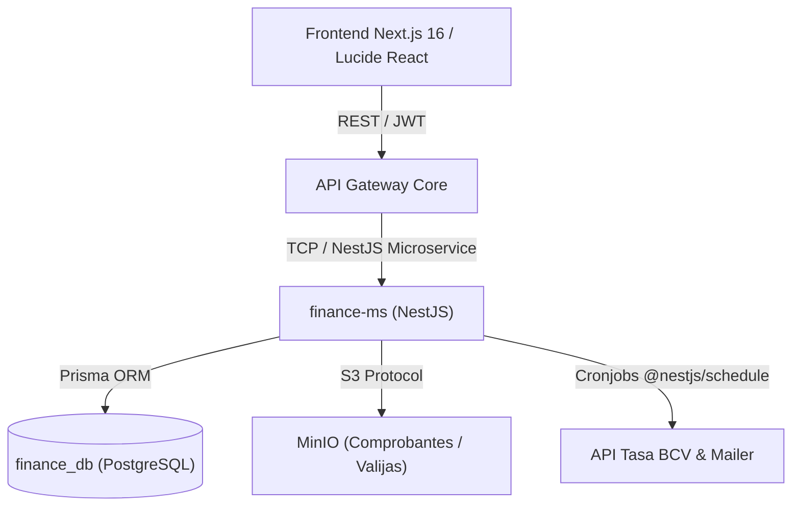

# 💰 MasterHub: Módulo de Finanzas (`finance-ms`)

Especificación de arquitectura, modelo de datos y roadmap de desarrollo del microservicio de finanzas para la plataforma empresarial [[masterhub-mg-hub|Proyecto: MasterHub (MG-HUB)]].

---

## 🏛 Arquitectura & Stack Tecnológico

* **Microservicio**: `finance-ms` (NestJS TCP Transport).
* **Persistencia**: PostgreSQL (`finance_db`) con Prisma ORM.
* **Almacenamiento**: MinIO (S3) para valijas digitales y comprobantes de pago.
* **Automatización**: Cronjob BCV diario + Cronjob Propuesta Semanal de Pago (Martes 5:00 PM).

---

## 📅 Roadmap por Fases y Módulos

### 🔴 FASE 1: Cuentas por Pagar (CxP) & Motor Fiscal SENIAT
- **R1.1 Verificación Xetux**: Requisito previo mandatorio de validación en Xetux por BU.
- **R1.2 Clasificación de Documentos**: Facturas Fiscales, Notas de Entrega y Recibos.
- **R1.3 Tasa BCV & Bloqueo de IVA**: El IVA se congela a la tasa BCV de la **fecha de emisión** (Art. 16 Ley IVA).
- **R1.4 Motor de Retenciones**:
  - **IVA**: 75% o 100% según contribuyente especial SENIAT.
  - **ISLR**: Condominios 2%, Alquileres 5%, Fletes 3%, Servicios Técnicos.
- **R1.5 Correlativos SENIAT**: Estructura de 14 dígitos para IVA e ISLR.
- **R1.6 Propuesta Semanal de Pago**: PDF consolidado automático los **Martes a las 5:00 PM** para aprobación de Dirección.

### 🟡 FASE 2: Egresos, Enrutamiento Bancario & TXT
- **R2.1 Enrutamiento de Cuentas**:
  - Facturas Fiscales ➔ Banco Nacional de Crédito (**BNC**).
  - Notas de Entrega ➔ Banco **Provincial**.
- **R2.2 Archivos Planos TXT**: Generación de archivos lotes de pago para BNC y Provincial.
- **R2.3 Soportes en MinIO**: Carga obligatoria de transferencias e integración de notificaciones.

### 🔵 FASE 3: Cuentas por Cobrar (CxC) & Conciliación Bancaria
- **R3.1 Conciliación Masiva CSV**: Cruce automático de ventas Xetux vs. Extractos bancarios por sede.
- **R3.2 Calculadora de Comisiones POS**: Descuento 2% ISLR TC y comisión 0.30% por lote.

### 🟢 FASE 4: Caja Chica, Cuota de Marketing (4%) & Dashboard
- **R4.1 Arqueo de Caja Chica**: Cuadre de efectivo semanal los **Miércoles** por sucursal.
- **R4.2 Cuota de Marketing (4%)**: Deducción automática sobre la venta neta sin IVA.

---

## 🔗 Referencias Cruzadas
- [[masterhub-mg-hub|Proyecto: MasterHub (MG-HUB)]]
- [[requerimiento-modulo-finanzas|Resumen: Módulo de Finanzas (finance-ms)]]
- [[pilar-finanzas-personales|Área Finanzas - Gestión Económica]]
