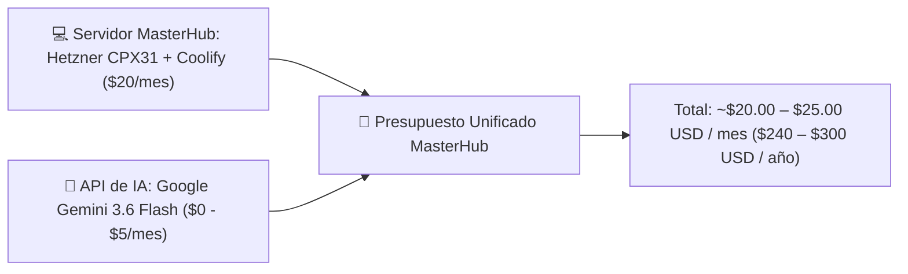

# 💻 Presupuesto de Infraestructura de Servidores & Costos de Planes de IA (MasterHub)

**Documento Elaborado por**: ALFRED (Asistente Ejecutivo & Sistema 2brain)  
**Proyecto**: MasterHub (MGH) & Asistentes de IA  
**Fecha de Emisión**: 17 de Septiembre de 2026  

---

## ☁️ PARTE 1: Estudio de Infraestructura de Servidores (Hosting MasterHub)

### 📌 Footprint Arquitectónico de MasterHub (MGH)
MasterHub opera bajo una arquitectura multimicroservicio en Node.js/TypeScript y Next.js:
- **7 Contenedores Docker**: `frontend-ui-dashboard` (Next.js 16), `api-gateway` (NestJS), `auth-ms`, `inventory-ms`, `helpdesk-ms`, `hr-ms`, `finance-ms`.
- **Bases de Datos Relacionales**: PostgreSQL (`auth_db`, `inventory_db`, `helpdesk_db`, `hr_db`, `finance_db`).
- **Almacenamiento de Archivos S3**: MinIO / S3 Object Storage (PDFs, valijas, expedientes de empleados).

---

### 📊 Comparativa de Opciones de Servidor

| Proveedor / Opción | Infraestructura / Especificación | Costo Mensual | Costo Anual | Pros & Nivel de Control |
| :--- | :--- | :---: | :---: | :--- |
| **🏆 Opción 1: Hetzner Cloud + Coolify (Recomendada)** | VPS Dedicated vCPU (CPX31: 4 vCPU AMD EPYC, 8 GB RAM, 160 GB NVMe SSD, Caddy SSL auto) | **$15 – $25 USD** | **$180 – $300 USD** | **100% Costo Fijo**. Rendimiento bruto imbatible, despliegue continuo tipo Vercel con Coolify PaaS. |
| **Opción 2: Híbrido PaaS (Railway / Render + Aiven DB)** | Microservicios en Railway/Render + Aiven Cloud Managed PostgreSQL | **$35 – $65 USD** | **$420 – $780 USD** | Cero gestión de Linux. Cuesta más por contenedor activo 24/7. |
| **Opción 3: DigitalOcean** | DigitalOcean App Platform + Managed PostgreSQL + Spaces S3 | **$48 – $85 USD** | **$576 – $1,020 USD** | Panel de administración intuitivo corporativo. |
| **Opción 4: AWS (Amazon Web Services)** | AWS App Runner / ECS Fargate + RDS PostgreSQL + Amazon S3 | **$70 – $130 USD** | **$840 – $1,560 USD** | Nube corporativa estándar. Alta complejidad y cobro por ancho de banda saliente (egress). |

---

## 🤖 PARTE 2: Estudio de Planes y Costos de Modelos de IA (APIs & Suscripciones)

### 📊 Desglose de Proveedores de IA (Modelos LLM & Multimodal)

| Proveedor / Modelo | Tipo de Servicio | Costo por Tokens / Usuario | Uso Recomendado en MasterHub & 2brain |
| :--- | :--- | :--- | :--- |
| **Google Gemini (Gemini 3.6 Flash / 2.5 Flash)** | API Studio / Vertex | **Free Tier Gratis** (15 RPM) / **$0.075 input - $0.30 output por 1M tokens** | **Principal (Recomendado)**: Extremadamente rápido, soporte multimodal (audio, PDF, visión) y costo cercano a $0 USD/mes. |
| **Google Gemini (Gemini 1.5 / 3.6 Pro)** | API Studio / Vertex | $1.25 input - $5.00 output por 1M tokens | Análisis profundo, exégesis teológica avanzada y tareas complejas de razonamiento. |
| **OpenAI (GPT-4o-mini)** | API HTTP | $0.15 input - $0.60 output por 1M tokens | Clasificación rápida de tickets y resúmenes de soporte. |
| **OpenAI (GPT-4o / ChatGPT Plus)** | API / Suscripción | $20 USD/mes por usuario / API $2.50-$10.00 por 1M tokens | Licencia individual para desarrollo/copilot. |
| **Anthropic Claude (Claude 3.5 Sonnet)** | API / Suscripción | $20 USD/mes por usuario / API $3.00-$15.00 por 1M tokens | Refactorización avanzada de código y arquitectura. |
| **DeepSeek (DeepSeek V3 / R1)** | API HTTP | $0.14 input - $0.28 output por 1M tokens | Alternativa económica para procesamiento masivo de texto. |

---

## 💰 PARTE 3: Presupuesto Total Consolidado Recomendado (Empresarial / Eficiente)

### 🎯 Resumen Ejecutivo para la Presentación:
1. **Servidores MasterHub**: **$20.00 USD/mes** (Servidor Hetzner con 4 vCPU AMD EPYC, 8 GB RAM y SSD NVMe albergando los 7 microservicios + PostgreSQL + S3).
2. **Consumo de IA (Automatizaciones, Bot ALFRED & MasterHub)**: **~$0.00 a $5.00 USD/mes** (Aprovechando el nivel gratuito y la tarifa de $0.075 USD/1M tokens de Google Gemini 3.6 Flash).
3. **Costo Mensual Total de Operación**: **~$20.00 – $25.00 USD / mes** ($240.00 – $300.00 USD / año), garantizando rendimiento corporativo sin sobrecostos.
