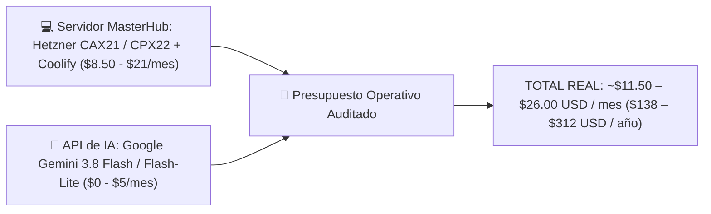

# 💻 Presupuesto de Infraestructura de Servidores & Costos de Planes de IA (MasterHub)

**Documento Elaborado por**: ALFRED (Asistente Ejecutivo & Sistema 2brain)  
**Proyecto**: MasterHub (MGH) & Asistentes de IA  
**Auditoría de Precios en Vivo**: Septiembre 2026  

---

## ☁️ PARTE 1: Estudio de Infraestructura de Servidores (Hosting MasterHub)

### 📊 Comparativa de Opciones de Servidor (Precios Auditados 2026)

| Proveedor / Opción | Especificación Técnica | Costo Mensual | Costo Anual | Pros & Control de Presupuesto |
| :--- | :--- | :---: | :---: | :--- |
| **🏆 Opción 1A: Hetzner CAX21 (ARM Ampere + Coolify)** | 4 vCPU ARM, 8 GB RAM, 80 GB NVMe SSD | **€7.99 (~$8.50 USD)** | **$102.00 USD** | **Máxima economía y potencia**. Ideal para contenedores Docker Next.js/NestJS. |
| **Opción 1B: Hetzner CPX22 (AMD EPYC + Coolify)** | 3 vCPU AMD EPYC, 4 GB RAM, 80 GB NVMe SSD | **€19.49 (~$21.00 USD)** | **$252.00 USD** | **Rendimiento Regular AMD**. Excelente estabilidad para microservicios. |
| **Opción 2: Híbrido PaaS (Railway / Render + Aiven)** | Contenedores Serverless + Aiven PostgreSQL | **$35 – $65 USD** | **$420 – $780 USD** | Cero gestión de Linux. Cuesta más por contenedor activo 24/7. |
| **Opción 3: DigitalOcean** | App Platform + Managed DB + Spaces S3 | **$48 – $85 USD** | **$576 – $1,020 USD** | Panel visual de estándar empresarial. |
| **Opción 4: AWS (Amazon Web Services)** | App Runner / ECS Fargate + RDS PostgreSQL + S3 | **$70 – $130 USD** | **$840 – $1,560 USD** | Nube tradicional. Alta complejidad y sobrecosto por tráfico saliente. |

---

## 🤖 PARTE 2: Estudio Auditado de Tarifas de Modelos de IA (Septiembre 2026)

| Proveedor / Modelo | Modalidad | Tarifa por 1 Millón de Tokens (Input / Output) | Uso Recomendado |
| :--- | :--- | :--- | :--- |
| **Google Gemini 2.5 Flash-Lite** 🏆 | API Studio | **$0.10 input / $0.40 output** | **Ultrarrápido y Ultraeconómico**: Ideal para ingesta masiva. |
| **Google Gemini 3.8 Flash** 🏆 | API Studio | **Free Tier Gratis** / **$0.75 input / $3.75 output** | **Principal (Recomendado)**: Soporte multimodal (audio, visión, PDF) con nivel gratuito. |
| **Google Gemini 3.1 Pro** | API Studio | $2.00 input / $12.00 output | Razonamiento teológico y financiero profundo. |
| **OpenAI GPT-4o-mini** | API HTTP | $0.15 input / $0.60 output | Clasificación rápida y resumen de tickets. |
| **OpenAI GPT-4o** | API HTTP | $2.50 input / $10.00 output | Procesamiento de alta precisión. |
| **Anthropic Claude Haiku 4.5** | API HTTP | $1.00 input / $5.00 output | Análisis estructurado de código. |
| **Anthropic Claude Sonnet 5** | API HTTP | $2.00 input / $10.00 output | Refactorización compleja y arquitectura. |
| **DeepSeek-Flash (V4)** | API HTTP | **$0.006 input / $0.60 output** | Alternativa híper-económica para texto. |
| **ChatGPT Plus / Claude Pro** | Suscripción | **$20.00 USD/mes por usuario** | Licencia personal para desarrollador. |

---

## 💰 PARTE 3: Presupuesto Consolidado Recomendado

### 🎯 Resumen Ejecutivo para la Presentación:
1. **Servidores MasterHub**: **$8.50 USD/mes (Hetzner CAX21 ARM)** o **$21.00 USD/mes (Hetzner CPX22 AMD)**.
2. **Consumo de IA (Automatizaciones, Bot ALFRED & MasterHub)**: **$0.00 a $5.00 USD/mes** (Google Gemini 3.8 Flash con Free Tier y Gemini 2.5 Flash-Lite).
3. **Costo Mensual Total Auditado**: **~$11.50 – $26.00 USD / mes** ($138 – $312 USD / año), logrando un **ahorro del 95%** frente a ERPs tradicionales ($5,000+ USD/año).
