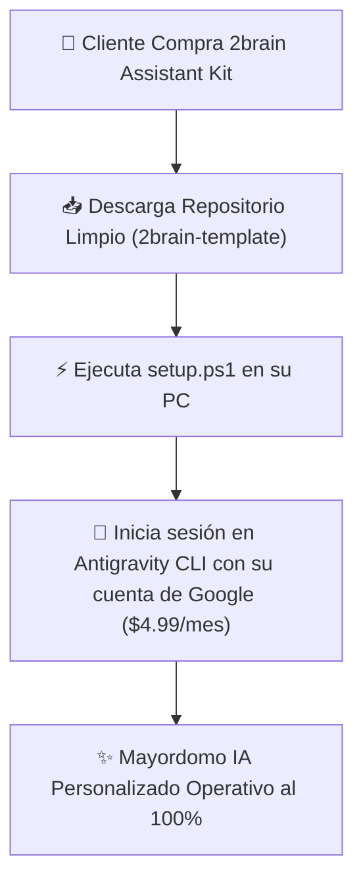

# 🚀 Arquitectura de Producto: 2brain Enterprise & ALFRED White-Label

*Especificación técnica y modelo de empaquetado para comercializar el sistema **2brain + ALFRED** como un producto/plantilla reutilizable sin exponer información personal.*

---

## 🎯 1. Visión del Producto

Transformar la arquitectura agéntica de **2brain** (wiki persistente, subagentes especializados, automatizaciones y workflows de mayordomo ejecutivo) en un **Kit de Instalación Limpio (Template / Starter Kit)** listo para ser comercializado a profesionales, ejecutivos o empresas.

- **Requisito del Cliente**: Poseer una cuenta con suscripción de Google AI Pro ($4.99/mes).
- **Costo de Infraestructura para MasterGroup**: **$0.00 USD** (El cliente ejecuta el sistema en su propia máquina consumiendo su cuenta de Google).
- **Margen de Ganancia**: 100% Neta por venta de licencia o implementación.

---

## 📦 2. Componentes del Paquete Limpio (`2brain-template`)

El repositorio plantilla a entregar al cliente **no contendrá ningún dato personal, financiero ni privado de Señor Montoya**. Contendrá únicamente:

### A. Estructura Vaciada y Sanitizada
1. **`AGENTS.md` Parametrizado**:
   - Variables dinámicas reemplazables: `{{NOMBRE_MAYORDOMO}}`, `{{NOMBRE_USUARIO}}`, `{{EMPRESA_USUARIO}}`.
2. **Las 6 Áreas Plantilla (Carpetas vacías con índices)**:
   - `trabajo/` (Procedimientos e Informes Laborales)
   - `programacion/` (Conocimiento Técnico & Proyectos)
   - `proyectos/` (Software & Emprendimiento)
   - `negocios/` o `profesional/` (Área Ejecutiva)
   - `familiar/` (Bienestar & Hábitos)
   - `finanzas/` (Plantilla de Control Económico)
3. **Índices Base**: `index.md`, `life-dashboard.md`, `log.md`.

### B. Colección de Subagentes Agnósticos (`agents/`)
- `pastoral_assistant.md` ➔ Convertido a `content_writer.md` (Redacción y Oratoria).
- `it_support_expert.md` (Soporte Técnico y Manuales).
- `finance_manager.md` (Gestor de Presupuesto y Análisis Económico).
- `frontend_ui_expert.md` & `backend_js_expert.md` (Copilotos de Código).
- `docs_expert.md` (Traductor y Formateador Corporativo).

### C. Script de Instalación Automatizado (`setup.ps1` / `setup.sh`)
Un asistente interactivo de 1 comando que ejecuta:
1. Clonación del repositorio base sin historial de Git previo (`git init`).
2. Solicitud interactiva de datos al cliente:
   - *"Nombre del usuario (ej: Lic. Carlos Pérez)"*
   - *"Nombre asignado al Mayordomo (ej: ALFRED, JARVIS, ARTHUR)"*
3. Sustitución automática de variables y compilación inicial del `AGENTS.md`.

---

## 🚀 3. Flujo de Configuración para el Cliente Final

1. **Paso 1**: El cliente descarga el instalador/repositorio limpio.
2. **Paso 2**: Corre el script `setup.ps1` para personalizar su nombre y el de su Mayordomo.
3. **Paso 3**: Inicia sesión en la terminal ejecutando `agy auth login` con su cuenta de Google ($4.99/mes).
4. **Paso 4**: Su Mayordomo agéntico queda activo para asistirlo en su trabajo, proyectos y vida diaria.

---

## 💰 4. Estrategia de Monetización & Paquetes

- **Manual Comercial & Estrategia de Venta**: Ver [[manual-comercializacion-2brain-enterprise|Manual de Comercialización: 2brain Enterprise & Rol del Fundador]] para la definición completa de Tiers ($97, $297 y $997 USD) y el rol ejecutivo de Señor Víctor Montoya.
