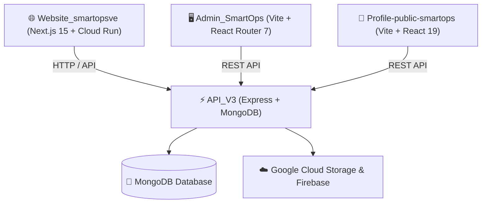

# ⚡ Ecosistema SmartOps VE: Arquitectura de Repositorios y Módulos

El ecosistema **SmartOps VE** es una plataforma SaaS distribuida compuesta por 4 repositorios principales interconectados bajo la cuenta de GitHub **`vmontoyasmtop`**:

---

## 🏛️ 1. Visión General de la Arquitectura

---

## 📦 2. Desglose Detallado de Repositorios

### 1. ⚙️ `vmontoyasmtop/API_V3` (Backend Central & REST API)
- **Repositorio**: `git@github-smartops:vmontoyasmtop/API_V3.git`
- **Nombre de App**: `smartops_api_v2`
- **Stack**: Node.js, Express 4.21, MongoDB / Mongoose 8.15, JWT, Joi, Winston, Multer, Swagger UI.
- **Módulos Principales**:
  - `core/subscriptions`: Gestión de planes, facturación y niveles de suscripción.
  - `crm`: Gestión de clientes, leads y seguimiento.
  - `ecommerce`: Carrito de compras (`cart`), pasarela/checkout.
  - `inventory`: Control de inventario y existencias.
  - `orders`: Procesamiento de órdenes y pedidos.
  - `products`: Catálogo de productos y variantes.
  - `professionals`: Gestión de perfiles profesionales.
  - `services`: Catálogo de servicios técnicos.
- **Pruebas & Seeds**: Jest + Supertest + MongoDB Memory Server + Seeds (`seed:plans`, `seed:superadmin`).

### 2. 🌐 `vmontoyasmtop/Website_smartopsve` (Portal Web & Landing Corporativa)
- **Repositorio**: `git@github-smartops:vmontoyasmtop/Website_smartopsve.git`
- **Nombre de App**: `website-smartopsve-and-profiles`
- **Stack**: Next.js 15.5, React 18.3, Tailwind CSS 3.4, Radix UI, Material UI 7, Framer Motion, Firebase Admin SDK 13.5, Firebase Functions 6.
- **Linter & Formatter**: Biome 1.9 + TypeScript 5.8.
- **Despliegue & DevOps**: Docker (Multi-stage build) + Google Cloud Run (`gcloud run deploy web-smartops`).

### 3. 🖥️ `vmontoyasmtop/Admin_SmartOps` (Panel Administrativo de Control)
- **Repositorio**: `git@github-smartops:vmontoyasmtop/Admin_SmartOps.git`
- **Nombre de App**: `dashboard-smartops`
- **Stack**: Vite 6.3, React 18, React Router DOM 7, Tailwind CSS 3.4, Radix UI (Suite completa), Recharts 3.0, Axios 1.10, Zod 3.25, React Hook Form, Sonner / Toastify.
- **Propósito**: Panel administrativo central para métricas, gestión de planes, usuarios, órdenes y configuraciones del sistema.

### 4. 📱 `vmontoyasmtop/Profile-public-smartops` (Portal Público de Perfiles)
- **Repositorio**: `git@github-smartops:vmontoyasmtop/Profile-public-smartops.git`
- **Nombre de App**: `smartops-public-frontend`
- **Stack**: Vite 7.1, React 19, React Router DOM 6.20, Tailwind CSS 3.3, Axios, Lucide React.
- **Despliegue**: Firebase Hosting (`firebase deploy`).
- **Propósito**: Aplicación frontend ultraligera y optimizada para la visualización de perfiles públicos de clientes y profesionales.

---

## 🔗 Relación en 2brain
- [[smartops-ve|Ficha Principal SmartOps VE]]
- [[pilar-proyectos|Área Proyectos]]
- [[pilar-programacion|Área Programación]]
