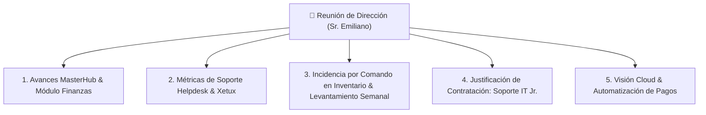

# 📋 Agenda Ejecutiva & Minuta de Reporte: Reunión con Dirección (Sr. Emiliano)

**Fecha de la Reunión**: Miércoles 16 de Septiembre, 2026  
**Participantes**: Sr. Emiliano (Dirección General) & Ing. Víctor Montoya (Analista IT & Líder de Arquitectura)  
**Área**: 🏢 `trabajo` & 🚀 `proyectos`  
**Autor**: ALFRED (2brain System)  

---

## 🎯 Objetivo de la Reunión

Presentar el informe de gestión de soporte técnico IT, reportar de forma transparente la incidencia del módulo de inventario con su respectivo plan de mitigación, presentar el balance de desarrollo de **MasterHub (MGH)** y solicitar la aprobación para la contratación de un **Soporte Técnico Jr. (Nivel 1)** que optimice los tiempos de entrega.

---

## 📑 Agenda Propuesta (5 Puntos Clave)

---

### 🟢 PUNTO 1: Avances de Desarrollo en MasterHub (MGH)

* **Resumen de Módulos Activos**:
  - `auth-ms`: Autenticación segura y roles corporativos.
  - `helpdesk-sm`: Gestión de tickets con Matriz de Eisenhower.
  - `hr-ms`: Avance en Fase 1 (Core de Expedientes) y Fase 2 (Reclutamiento/Vacantes).
* **Presentación del Módulo de Finanzas (`finance-ms`)**:
  - Presentación de la propuesta comercial para automatizar CxP, CxC, motor fiscal SENIAT (retenciones 75%/100% e ISLR) y enrutamiento bancario (BNC / Provincial).
  - **Opciones de Ejecución**:
    - **Opción A (Estándar)**: $2,400.00 USD (12 semanas / 4 cuotas de $600 USD).
    - **Opción B (Exprés por Premura)**: $6,000.00 USD (6 semanas / 4 cuotas de $1,500 USD).

---

### 🟡 PUNTO 2: Gestión de Soporte Helpdesk & Sucursales Xetux

* **Balance de Atención**:
  - Clasificación de tickets bajo la Matriz de Eisenhower (`[Q1]` Urgente/Importante vs `[Q2]` Importante/No urgente).
  - Resolución de incidencias críticas en sucursales Xetux (equipos de caja, balanzas, spooler de impresoras y configuración de visualización).
* **Mantenimiento Físico e Infraestructura**:
  - Avance en desincorporación de equipos Hikvision en control de acceso de puerta adicional en Master.

---

### 🔴 PUNTO 3: Incidencia en Inventario (Error por Comando) & Plan de Levantamiento Semanal

#### A. Diagnóstico Transparente del Problema
- Se detectó una pérdida accidental de registros de equipos de cómputo en la base de datos producida por la **ejecución errónea de un comando**.

#### B. Plan de Acción Inmediato & Estrategia de Prevención (5 Pasos):
1. **Plan de Levantamiento Semanal Programado**: Se agendarán jornadas semanales periódicas para realizar la toma física e inventariado recurrente de equipos en sedes, asegurando información auditada y 100% al día.
2. **Desarrollo del Módulo de Backup Local de DB**: Se construyó un módulo de respaldo automatizado de la base de datos para generar y almacenar copias de seguridad locales continuas de toda la data de MasterHub.
3. **Recuperación de Datos**: Reconstrucción progresiva de la información a partir de respaldos de base de datos, trazabilidad de entregas y los levantamientos semanales agendados.
4. **Implementación de Soft Delete (Borrado Lógico)**:
   - Modificación del esquema en Prisma ORM (`inventory-sm`) agregando la propiedad `deletedAt DateTime?`.
   - **Garantía**: NINGÚN registro se borrará físicamente de la base de datos (`DELETE`); únicamente se ocultará de la interfaz visual (`deletedAt = NOW()`), permitiendo restauración con un solo clic.
5. **Audit Trail & Control de Comandos**: Registro de auditoría (usuario, fecha, hora e IP) y bloqueo de comandos directos sin respaldo previo.

---

### 👤 PUNTO 4: Justificación de Contratación: Soporte Técnico Jr. (Nivel 1)

#### A. El Problema Actual de Capacidad:
- Actualmente, el Ing. Víctor Montoya atiende de forma simultánea la **arquitectura/desarrollo de MasterHub** y el **soporte reactivo Nivel 1** (cambio de toners, formateo de laptops, cableado estructurado, atención telefónica a cajeros de Xetux).
- Esta dualidad genera interrupciones continuas en los bloques de *Focus Time*, retrasando el avance de MasterHub.

#### B. Beneficios del Nuevo Cargo (Soporte IT Jr.):
* **Liberación de Carga Operativa**: El Soporte Jr. asumirá las tareas reactivas de Nivel 1.
* **Aceleración de MasterHub**: Permite a Víctor dedicarse al 100% al desarrollo del Módulo de Finanzas, RRHH e integración corporativa.
* **Costo-Beneficio**: Un perfil Jr. de soporte tiene un costo bajo para la empresa y genera un ROI inmediato al acelerar los sistemas propios de Master Group.

---

### 💡 PUNTO 5: Sugerencia Estratégica (Cloud & Automatizaciones)

1. **Ahorro en Hosting Nube para MasterHub**:
   - Presentación del estudio comparativo de infraestructura: Despliegue en **Hetzner Cloud + Coolify por ~$18.00 USD/mes**, representando un ahorro del **+90%** frente a licencias de Profit/Odoo ($5,000+ USD).
2. **Cronjob de Propuesta Semanal de Pago**:
   - Automatización en `finance-ms` para enviar a la Dirección (Sr. Emiliano) todos los **Martes a las 5:00 PM** la propuesta consolidada de pagos de facturas vencidas en formato PDF.

---

## 📌 Guión Verbal Recomendado para Víctor durante la Reunión

> *"Don Emiliano, buenos días. Hoy quiero reportarle 3 pilares clave: el avance de MasterHub, el estado del soporte técnico y una mejora de seguridad que ya estamos implementando.*
>
> *Primero, en MasterHub tenemos listos los avances de RRHH y la propuesta del Módulo de Finanzas para eliminar de una vez por todas los Excel sueltos y automatizar las retenciones del SENIAT.*
>
> *Segundo, sobre la incidencia en inventario: le informo con total transparencia que se produjo una eliminación accidental de registros debido a un error en la ejecución de un comando en la base de datos. Para solventar esto y dejar el sistema blindado, hemos diseñado un plan de levantamiento físico semanal para mantener la información al día, además de implementar 'Soft Delete' en el código y haber desarrollado un módulo de respaldo automatizado de la base de datos para contar con copias de seguridad locales continuas de toda la data de MasterHub.*
>
> *Tercero, para que MasterHub avance al doble de velocidad y no sufra retrasos, le propongo incorporar un Soporte Técnico Jr. que atienda los tickets básicos de impresoras y sucursales, permitiéndome a mí enfocarme 100% en programar los sistemas de la empresa."*
