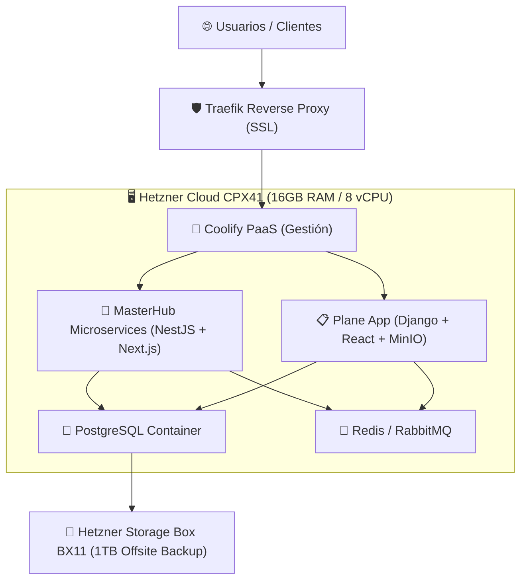

# 🏗️ Arquitectura y Configuración Óptima en Hetzner para MasterHub & Plane

*Propuesta ejecutiva de infraestructura y dimensionamiento de servidores en Hetzner Online para ejecutar MasterHub (MG-HUB) y Plane (makeplane/plane) de forma simultánea con rendimiento óptimo.*

---

## 📊 1. Estimación de Cargas de Trabajo (Workload Benchmark)

| Plataforma | Componentes Internos | Memoria RAM | vCPU Recomendada |
| :--- | :--- | :---: | :---: |
| **MasterHub** (`MG-HUB`) | API Gateway, `hr-ms`, `finance-ms`, `auth-ms`, `inventory-sm`, `helpdesk-sm`, Next.js Dashboard, PostgreSQL, Redis, RabbitMQ. | 6 GB – 8 GB | 4 vCPUs |
| **Plane** (`makeplane`) | App Web React, API Django, PostgreSQL, Redis, Worker Queues, MinIO S3. | 4 GB – 6 GB | 2 – 4 vCPUs |
| **PaaS & Proxy (Coolify)** | Dashboard Coolify, Reverse Proxy Traefik, Certificados SSL Let's Encrypt. | 1 GB – 2 GB | 1 vCPU |
| **REQUERIMIENTO CONJUNTO** | **Producción Óptima Conjunta** | **14 GB – 16 GB RAM** | **6 – 8 vCPUs** |

---

## 🏆 2. Opción Sugerida: Servidor Consolidado de Alto Rendimiento (Opción 1)

Un único servidor VPS potente administrado con **Coolify** que hospeda tanto **MasterHub** como **Plane** en contenedores aislados con certificados SSL automáticos y almacenamiento NVMe.

### Especificaciones Técnicas del Servidor:
- **Servidor Hetzner Cloud**: **CPX41** (x86 AMD EPYC) o **CAX41** (ARM64 Ampere Altra).
  - **Recursos**: **8 vCPUs | 16 GB RAM | 240 GB NVMe SSD** (o CAX41: **16 vCPUs | 32 GB RAM**).
  - **Ubicación recomendada**: EE. UU. (Ashburn, VA) para baja latencia con Venezuela/LATAM, o Alemania (Falkenstein).
  - **Enlace oficial**: [Hetzner Cloud Console](https://console.hetzner.cloud/) | [Tarifas Hetzner Cloud](https://www.hetzner.com/cloud)
- **Servicio de Respaldo Externe**: **Storage Box BX11** (1 TB de almacenamiento masivo SFTP/rsync).
  - **Enlace oficial**: [Hetzner Storage Box](https://www.hetzner.com/storage/storage-box)

### Presupuesto Estimado Mensual:
- **Servidor Hetzner Cloud (CPX41 / CAX41)**: ~$25.00 – $34.00 USD/mes
- **Storage Box (BX11 - 1 TB)**: ~$3.80 USD/mes
- **TOTAL INVERSIÓN MENSUAL**: **~$30.00 – $38.00 USD / mes**

---

## 🛠️ 3. Esquema de Despliegue con Coolify

---

## 🔗 Enlaces Oficiales de Referencia
- **Panel de Control de Hetzner Cloud**: [https://console.hetzner.cloud/](https://console.hetzner.cloud/)
- **Calculadora de Tarifas Hetzner Cloud**: [https://www.hetzner.com/cloud](https://www.hetzner.com/cloud)
- **Página Oficial Storage Box**: [https://www.hetzner.com/storage/storage-box](https://www.hetzner.com/storage/storage-box)
- **Documentación de Coolify**: [https://coolify.io](https://coolify.io)
