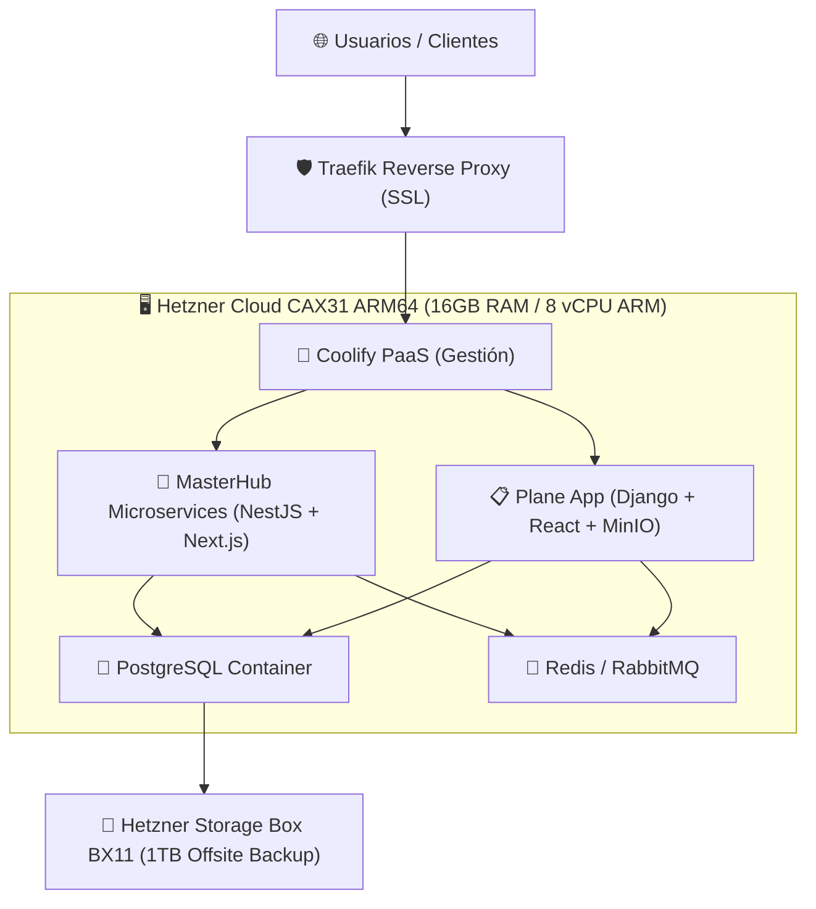

# 🏗️ Arquitectura y Configuración Óptima en Hetzner para MasterHub & Plane

*Propuesta ejecutiva de infraestructura y dimensionamiento de servidores en Hetzner Online para ejecutar MasterHub (MG-HUB) y Plane (makeplane/plane) de forma simultánea con rendimiento óptimo.*

---

## 📊 1. Estimación de Cargas de Trabajo (Workload Benchmark)

| Plataforma | Componentes Internos | Memoria RAM | vCPU Recomendada |
| :--- | :--- | :---: | :---: |
| **MasterHub** (`MG-HUB`) | API Gateway, `hr-ms`, `finance-ms`, `auth-ms`, `inventory-sm`, `helpdesk-sm`, Next.js Dashboard, PostgreSQL, Redis, RabbitMQ. | 6 GB – 8 GB | 4 vCPUs |
| **Plane** (`makeplane`) | App Web React, API Django, PostgreSQL, Redis, Worker Queues, MinIO S3. | 4 GB – 6 GB | 2 – 4 vCPUs |
| **PaaS & Proxy (Coolify)** | Dashboard Coolify, Reverse Proxy Traefik, Certificados SSL Let's Encrypt. | 1 GB – 2 GB | 1 vCPU |
| **REQUERIMIENTO CONJUNTO** | **Producción Óptima Conjunta** | **14 GB – 16 GB RAM** | **6 – 8 vCPUs** |

---

## 🏆 2. Opción Sugerida: Servidor CAX31 ARM64 (Opción de Máxima Eficiencia Costo/Potencia)

Debido al ajuste de tarifas de la línea x86 dedicada (`CPX41` subió a ~$142/mes en 2026), la línea **CAX (ARM64 Ampere Altra)** es la opción recomendada de Hetzner para mantener alto rendimiento a bajo costo.

### Especificaciones Técnicas del Servidor Sugerido:
- **Servidor Hetzner Cloud**: **CAX31** (Arquitectura ARM64 Ampere Altra).
  - **Recursos**: **8 vCPUs ARM | 16 GB RAM | 160 GB NVMe SSD**.
  - **Precio oficial Hetzner**: **~$24.99 USD / mes** (€20.99 / mes excl. IVA/IPv4).
  - **Ubicación recomendada**: Alemania (Falkenstein/Núremberg) o Finlandia (Helsinki).
  - **Compatibilidad**: 100% nativa con Docker, Coolify, Node.js, NestJS, Next.js, Python, Django y PostgreSQL en `linux/arm64`.
  - **Enlace oficial**: [Hetzner Cloud Console](https://console.hetzner.cloud/) | [Tarifas Hetzner Cloud](https://www.hetzner.com/cloud)

- **Opción Secundaria (4 vCPUs / 8 GB RAM)**: **CAX21**
  - **Recursos**: **4 vCPUs ARM | 8 GB RAM | 80 GB NVMe SSD**.
  - **Precio oficial**: **~$12.49 USD / mes** (€10.49 / mes).

- **Servicio de Respaldo Externo**: **Storage Box BX11** (1 TB de almacenamiento masivo SFTP/rsync).
  - **Precio**: **~$3.80 USD / mes**.

### Presupuesto Mensual Consolidado (CAX31 + Backup):
- **Servidor Hetzner Cloud (CAX31 16GB RAM)**: ~$24.99 USD/mes
- **Storage Box (BX11 - 1 TB)**: ~$3.80 USD/mes
- **TOTAL INVERSIÓN MENSUAL**: **~$28.79 USD / mes**

---

## 🛠️ 3. Esquema de Despliegue con Coolify

---

## 🔗 Enlaces Oficiales de Referencia
- **Panel de Control de Hetzner Cloud**: [https://console.hetzner.cloud/](https://console.hetzner.cloud/)
- **Calculadora de Tarifas Hetzner Cloud**: [https://www.hetzner.com/cloud](https://www.hetzner.com/cloud)
- **Página Oficial Storage Box**: [https://www.hetzner.com/storage/storage-box](https://www.hetzner.com/storage/storage-box)
