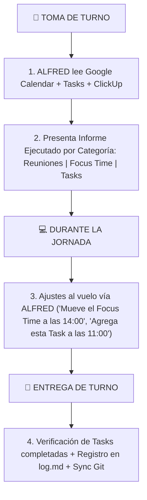

# 📅 Estándar Operativo: Organización de Calendario Laboral IT (Xetux / MasterGroup)

Modelo de administración del tiempo para equilibrar el rol de **Analista / Soporte IT** (reactivo) y **Desarrollador de Software / MasterHub** (proactivo/Deep Work) mediante las funciones avanzadas de Google Workspace.

---

## 🎯 1. Tipos de Bloques en el Calendario de Trabajo (`soporte@mastergroupve.com`)

| Tipo en Calendar | Nombre / Formato | Propósito Operativo | Comportamiento en Google Workspace |
| :--- | :--- | :--- | :--- |
| 🛡️ **Focus Time** | `🛡️ [Focus Time] Dev MasterHub` | Desarrollo de software ininterrumpido (Madrugada / Mañana / Tarde). | Auto-rechaza invitaciones a reuniones no programadas. Muestra estado de concentración en Chat/Meet. |
| 🤝 **Evento Standard** | `MKT / Ventas / RRHH Updates` | Reuniones de sincronización presenciales o por Google Meet. | Permite adjuntos de Drive, enlace de Meet y lista de asistentes con RSVP. |
| ⚡ **Bloque Reactivo** | `⚡ [Bloque Reactivo] Soporte Xetux` | Ventana de ráfaga para atender llamadas, tickets de Helpdesk y sucursales. | Permite interrupciones y soporte técnico a usuarios. |
| ☑️ **Google Task** | `Actualizar tasa BCV` / `Ticket #104` | Micro-acciones puntuales con hora exacta o fecha límite. | Aparecen en el panel lateral de Gmail/Calendar. Al completarse se tachan; si se vencen, se trasladan solas. |
| 📍 **Working Location**| `Oficina (Caracas Campus)` | Informar la presencia física (Oficina vs Remoto). | Visible en el perfil de Workspace para coordinar visitas presenciales. |

---

## 🔄 2. Flujo de Trabajo Diario con ALFRED

---

## 🛠️ 3. Reglas Operativas de Convivencia

1. **Cortafuegos de Focus Time**: Los bloques de Focus Time son sagrados. ALFRED no agendará compromisos de menor prioridad dentro de un bloque de Focus Time a menos que haya una urgencia crítica de producción (Caja / Sistema caído).
2. **Regla de Micro-tareas (<15 min)**: Cualquier pendiente que tome menos de 15 minutos se registra como **Google Task**, no como un evento de calendario.
3. **Notificaciones y Recordatorios**:
   - Eventos de reunión: Alerta a los 10 minutos prevíos.
   - Tasks: Notificación emergente a la hora fijada.
