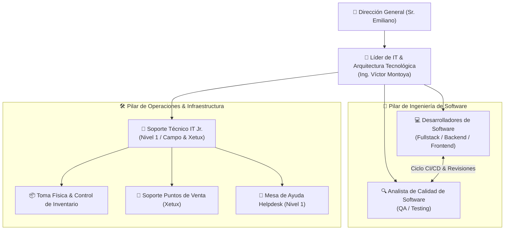
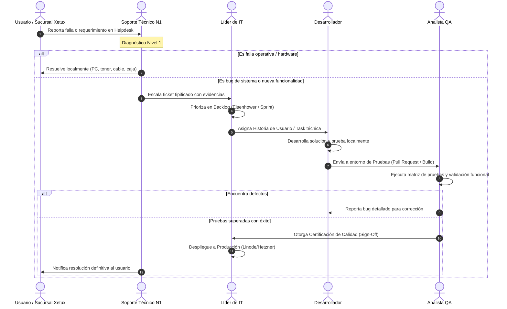

# 🏢 Manual Organizacional y Descriptivo de Cargos: Departamento de IT
**Empresa:** Master Group VE  
**Área:** Tecnología, Desarrollo e Infraestructura IT  
**Líder de Área / Autor:** Ing. Víctor Montoya  
**Aprobación Ejecutiva:** Dirección General (Sr. Emiliano)  
**Versión:** 1.0 — Oficial  
**Enlace Oficial Google Docs:** [Abrir Documento en Google Docs](https://docs.google.com/document/d/1Q265p4JbDPt9Y97IFdrrnUf8g5xLzyj4iGbXL0IkaKQ/edit)  

---

## 🎯 1. Propósito y Justificación del Manual

El presente documento formaliza la estructura organizativa, dependencias jerárquicas, responsabilidades, perfiles profesionales e indicadores de gestión (KPIs) del **Departamento de IT de Master Group**.

### Diagnóstico de Eficiencia Operativa
Históricamente, la concentración de tareas estratégicas (arquitectura y desarrollo de software como **MasterHub**) y tareas operativas/reactivas (atención telefónica a cajeros de Xetux, reparación física de impresoras, cableado y toma física de inventario) en una sola figura generaba una severa penalización por **cambio de contexto (*context switching*)**. 

Este manual segrega de forma técnica y profesional el área en dos pilares coordinados:
1. **Pilar de Ingeniería y Calidad de Software:** Responsable de la creación de valor corporativo, automatización y desarrollo de sistemas propietarios (Líder IT, Desarrolladores y QA).
2. **Pilar de Soporte Técnico e Infraestructura Operativa:** Responsable de la estabilidad de puestos de trabajo, atención inmediata en sucursales Xetux, mantenimiento de hardware y auditoría física de inventario (Soporte Técnico Nivel 1).

---

## 🏛️ 2. Estructura Organigráfica del Departamento

---

## 📋 3. Descriptivos Detallados de Cargos

---

### CARGO 1: Líder de IT & Arquitectura Tecnológica

| Identificación | Detalle |
| :--- | :--- |
| **Título del Cargo** | **Líder de IT & Arquitectura Tecnológica** |
| **Departamento** | Tecnología, Desarrollo e Infraestructura IT |
| **Reporta a** | Dirección General (Sr. Emiliano) |
| **Supervisa a** | Desarrolladores de Software, Analista QA, Soporte Técnico IT |
| **Nivel Jerárquico** | Jefatura / Táctico-Estratégico |
| **Modalidad** | Híbrida / Presencial Estratégica |

#### 1. Misión del Cargo
Liderar la estrategia tecnológica y de digitalización de Master Group, diseñando la arquitectura técnica de las plataformas corporativas (**MasterHub**), gestionando la infraestructura de servidores y redes, y dirigiendo el equipo multidisciplinario (Desarrollo, QA y Soporte) para garantizar la continuidad operativa, seguridad de datos y alta productividad.

#### 2. Responsabilidades Principales
1. **Arquitectura y Gobernanza de Software:**
   - Definir estándares técnicos, lenguajes, frameworks, esquemas de bases de datos (Prisma ORM/PostgreSQL) y patrones arquitectónicos modulares (`auth-ms`, `hr-ms`, `finance-ms`, `inventory-sm`, `helpdesk-sm`).
   - Aprobar *Pull Requests*, revisiones de código críticas y liderar los despliegues a entornos de producción.
   - Definir políticas de integridad de datos, migraciones seguras y borrado lógico (*soft delete*).
2. **Gestión de Infraestructura Cloud, Servidores y Seguridad:**
   - Administrar los entornos VPS (Linode, Hetzner, Coolify, Docker), optimizando costos y garantizando redundancia.
   - Diseñar y supervisar la política de copias de seguridad automatizadas (locales y remotas) y planes de recuperación ante desastres (DRP).
   - Planificar la seguridad de redes corporativas, firewalls y políticas de accesos basados en roles (RBAC).
3. **Planificación, Gestión del Backlog y Dirección:**
   - Traducir los requerimientos de la Dirección General y áreas funcionales (Finanzas, RRHH, Operaciones) en hojas de ruta técnicas ejecutables.
   - Asignar tareas a Desarrolladores y coordinar con QA los calendarios de liberación de versiones (*releases*).
   - Supervisar el cumplimiento de los Acuerdos de Nivel de Servicio (SLAs) del área de Soporte Técnico.
4. **Relación Ejecutiva y Presupuesto:**
   - Elaborar propuestas de inversión tecnológica, evaluación de herramientas (IA, licencias, hardware) y reporte periódico de avance y ROI a Dirección.

#### 3. Perfil del Ocupante
- **Educación:** Profesional graduado en Ingeniería en Sistemas, Computación, Informática o carrera afín.
- **Experiencia:** Mínimo 3 a 5 años en roles combinados de desarrollo de software, análisis de sistemas y coordinación técnica.
- **Conocimientos Técnicos Exigidos:**
  - TypeScript, Node.js, Python, React / Next.js, REST APIs, GraphQL.
  - Modelado de bases de datos relacionales (PostgreSQL, MySQL), ORMs y migraciones.
  - Administración de entornos Linux, Docker, contenedores y conceptos DevOps / CI/CD.
  - Redes TCP/IP empresariales, VPNs y seguridad perimetral.
- **Competencias Blandas:** Liderazgo técnico, capacidad de síntesis ejecutiva, priorización bajo impacto/urgencia, resiliencia y resolución estructurada de problemas.

#### 4. Indicadores Clave de Rendimiento (KPIs)
- **Disponibilidad de Plataformas Críticas (Uptime):** $\ge 99.5\%$.
- **Tasa de Entrega de Hojas de Ruta (Roadmap Delivery):** $\ge 85\%$ de épicas/módulos entregados en plazo acordado.
- **Cumplimiento de Políticas de Backup:** $100\%$ de copias automáticas validadas sin fallos de integridad.

---

### CARGO 2: Desarrollador de Software (Fullstack / Backend / Frontend)

| Identificación | Detalle |
| :--- | :--- |
| **Título del Cargo** | **Desarrollador de Software (Programador Fullstack)** |
| **Departamento** | Tecnología, Desarrollo e Infraestructura IT |
| **Reporta a** | Líder de IT & Arquitectura Tecnológica |
| **Supervisa a** | N/A |
| **Nivel Jerárquico** | Especialista Técnico / Operativo de Desarrollo |
| **Modalidad** | Presencial / Híbrida / Remota con seguimiento ágil |

#### 1. Misión del Cargo
Construir, mantener y optimizar los módulos, servicios e interfaces de usuario del ecosistema **MasterHub** y aplicaciones satélites de Master Group, siguiendo las directrices de arquitectura, buenas prácticas de código limpio y requerimientos del negocio.

#### 2. Responsabilidades Principales
1. **Desarrollo de Funcionalidades y Módulos:**
   - Escribir código limpio, modular, mantenible y debidamente tipado en los módulos asignados (`finance-ms`, `hr-ms`, etc.).
   - Desarrollar e integrar APIs RESTful, endpoints de autenticación y lógica de negocio.
   - Implementar componentes de interfaz de usuario receptivos, accesibles y consistentes con los lineamientos de diseño corporativo.
2. **Calidad del Código y Pruebas Unitarias:**
   - Elaborar pruebas unitarias y de integración para validar la lógica crítica antes de transferir a QA.
   - Ejecutar refactorizaciones controladas para optimizar el rendimiento y mitigar la deuda técnica.
3. **Flujo de Trabajo y Control de Versiones:**
   - Gestionar ramas de trabajo (*Git feature branching*), redactar commits descriptivos y documentar *Pull Requests*.
   - Corregir incidencias y *bugs* reportados por el Analista QA dentro de los tiempos pactados en el sprint.
   - Utilizar entornos y herramientas de asistencia tecnológica autorizadas (Antigravity CLI/IDE).

#### 3. Perfil del Ocupante
- **Educación:** TSU o Licenciatura/Ingeniería en Informática, Sistemas, Computación o experiencia comprobable equivalente en desarrollo de software.
- **Experiencia:** Mínimo 1 a 2 años en desarrollo activo de aplicaciones web (Fullstack, Backend o Frontend).
- **Conocimientos Técnicos Exigidos:**
  - Dominio de TypeScript / JavaScript moderno (ES6+).
  - Manejo de frameworks backend (Node.js, Express, NestJS o similar) y frontend (React, Vue o Next.js).
  - Consultas SQL, manejo de ORMs (Prisma, TypeORM o Drizzle).
  - Control de versiones con Git (GitHub / GitLab).
- **Competencias Blandas:** Trabajo en equipo, proactividad, pensamiento analítico, disciplina para documentar y apertura a la revisión técnica de código (*code review*).

#### 4. Indicadores Clave de Rendimiento (KPIs)
- **Tasa de Cumplimiento de Historias de Usuario / Tasks:** $\ge 90\%$ de puntos asignados completados por sprint.
- **Densidad de Defectos en Código:** Menos del $10\%$ de Pull Requests devueltos por QA con fallas funcionales críticas.
- **Tiempo de Resolución de Bugs (Bug Fix Turnaround):** $< 24$ horas para bugs de alta prioridad.

---

### CARGO 3: Analista de Aseguramiento de Calidad (QA / Tester de Software)

| Identificación | Detalle |
| :--- | :--- |
| **Título del Cargo** | **Analista de Aseguramiento de Calidad (QA Tester)** |
| **Departamento** | Tecnología, Desarrollo e Infraestructura IT |
| **Reporta a** | Líder de IT & Arquitectura Tecnológica |
| **Supervisa a** | N/A |
| **Nivel Jerárquico** | Especialista Técnico / Aseguramiento Operativo |
| **Modalidad** | Presencial / Híbrida / Remota |

#### 1. Misión del Cargo
Garantizar que todo incremento de software, módulo o corrección implementada en las plataformas de Master Group (**MasterHub**) cumpla estrictamente con los requerimientos funcionales, de usabilidad, integridad de datos y seguridad antes de su despliegue a producción, previniendo regresiones e interrupciones en la operación del negocio.

#### 2. Responsabilidades Principales
1. **Diseño y Ejecución de Pruebas:**
   - Analizar las especificaciones funcionales y diseñar matrices detalladas de casos de prueba (*Test Cases*), escenarios de borde (*edge cases*) y criterios de aceptación.
   - Ejecutar pruebas manuales y exploratorias: pruebas funcionales, de interfaz (UI/UX), de regresión, integración y pruebas de carga básica.
   - Probar flujos críticos de negocio (ejemplo: cálculos fiscales de retención SENIAT 75%/100%, generación de pagos, control de stock y conciliaciones en MasterHub).
2. **Gestión y Trazabilidad de Defectos (Bug Tracking):**
   - Documentar, clasificar y reportar incidencias con pasos reproducibles exactos, capturas, logs de red y niveles de severidad (`Crítico`, `Alto`, `Medio`, `Bajo`).
   - Dar seguimiento al ciclo de vida del defecto, retestear correcciones realizadas por los desarrolladores y certificar el cierre formal del ticket.
3. **Certificación de Releases & Automatización Progresiva:**
   - Emitir el dictamen formal de calidad (*Sign-Off*) para autorizar la publicación a producción.
   - Implementar pruebas de API automatizadas (Postman collections) y scripts de testing E2E (Cypress / Playwright) para flujos repetitivos.

#### 3. Perfil del Ocupante
- **Educación:** TSU o Ingeniero en Sistemas, Informática, Computación o formación técnica certificada en Testing de Software (ISTQB deseable).
- **Experiencia:** Mínimo 1 año en aseguramiento de calidad (QA), testing funcional de aplicaciones web y consumo de APIs.
- **Conocimientos Técnicos Exigidos:**
  - Creación de planes de prueba, casos de prueba y matrices de trazabilidad.
  - Manejo de Postman / Insomnia para pruebas de APIs REST.
  - Conocimiento en inspección de navegadores (Chrome DevTools: Red, Consola, Almacenamiento).
  - Nociones de consultas SQL para verificación de integridad de datos en bases de datos.
- **Competencias Blandas:** Minuciosidad, atención obsesiva al detalle, escepticismo constructivo, excelente comunicación asertiva y capacidad de negociación técnica con programadores.

#### 4. Indicadores Clave de Rendimiento (KPIs)
- **Eficacia de Detección de Defectos (DDE):** $\ge 95\%$ de los fallos detectados en fase de QA antes de salir a producción.
- **Fuga de Bugs a Producción (Defect Escape Rate):** $< 5\%$ de incidencias reportadas por usuarios finales tras un despliegue.
- **Claridad y Reproducibilidad de Reportes:** $100\%$ de reportes de bugs documentados con pasos exactos y evidencias.

---

### CARGO 4: Analista / Técnico de Soporte IT (Nivel 1 / Campo & Sucursales)

| Identificación | Detalle |
| :--- | :--- |
| **Título del Cargo** | **Soporte Técnico IT Jr. (Nivel 1 / Campo & Xetux)** |
| **Departamento** | Tecnología, Desarrollo e Infraestructura IT |
| **Reporta a** | Líder de IT & Arquitectura Tecnológica |
| **Supervisa a** | N/A |
| **Nivel Jerárquico** | Operativo / Asistencia de Campo |
| **Modalidad** | Presencial en Sedes y Oficinas Centrales |

#### 1. Misión del Cargo
Brindar soporte técnico reactivo y preventivo de primer nivel a usuarios administrativos y puntos de venta en sucursales Xetux, asegurando la continuidad de puestos de trabajo, periféricos y conectividad local, así como la ejecución semanal del levantamiento físico y etiquetado de inventario informático.

#### 2. Responsabilidades Principales
1. **Mesa de Ayuda (Helpdesk Nivel 1):**
   - Recibir, tipificar y solucionar tickets de primer contacto registrados en la plataforma de Helpdesk.
   - Instalación, formateo, clonación y configuración de equipos de cómputo (Windows 10/11, drivers, antivirus, herramientas de oficina).
   - Mantenimiento preventivo y correctivo de impresoras (recarga/cambio de tóner, limpieza de rodillos, desatascos, spooler de red) y balanzas.
2. **Soporte de Campo a Sucursales y Puntos de Venta (Xetux):**
   - Asistir telefónica o remotamente a cajeros ante fallas en puntos de venta (bloqueos de sesión, impresoras fiscales/tickets, pantallas de clientes).
   - Diagnóstico básico de conectividad de red local (cableado UTP RJ45, switches, access points, reinicio controlado de módems/routers).
   - Escalar ordenadamente al Líder de IT incidencias graves (caídas generales de enlace, inconsistencias en base de datos o fallos de software central).
3. **Control y Toma Física Semanal de Inventario:**
   - Realizar visitas semanales programadas a sedes para verificar físicamente los activos tecnológicos.
   - Etiquetar equipos con códigos identificadores y registrar de forma inmediata altas, bajas y transferencias en el módulo de inventario.
   - Custodiar el stock físico de repuestos, cables, periféricos y consumibles.

#### 3. Perfil del Ocupante
- **Educación:** Técnico Medio en Informática, TSU o estudiante de los primeros ciclos de carrera tecnológica afín.
- **Experiencia:** Mínimo 6 meses a 1 año en soporte a usuarios, mantenimiento de PC o Helpdesk.
- **Conocimientos Técnicos Exigidos:**
  - Ensamble, diagnóstico y reparación de hardware de computadores y laptops.
  - Configuración de sistemas operativos Windows y utilitarios corporativos.
  - Crimpado y prueba de cables de red UTP (norma T568A/B), configuración básica de IP y routers locales.
  - Manejo de herramientas de control remoto (AnyDesk, TeamViewer, RDP) y tickets de Helpdesk.
- **Competencias Blandas:** Alta vocación de servicio, paciencia en el trato interpersonal, puntualidad, orden metódico para el inventario físico y capacidad de seguimiento de manuales (SOPs).

#### 4. Indicadores Clave de Rendimiento (KPIs)
- **Tiempo de Primera Respuesta (FRT):** $< 15$ minutos para incidencias reportadas desde cajas de sucursales.
- **Resolución en Primer Contacto (FCR):** $\ge 70\%$ de tickets de nivel 1 cerrados sin requerir escalamiento.
- **Cobertura de Auditoría Física Semanal:** $100\%$ de equipos y sedes asignadas auditadas por cronograma.
- **Satisfacción del Usuario Interno (CSAT):** $\ge 90\%$ de calificaciones favorables.

---

## 🔄 4. Ciclo Operativo Integrado (SDLC + Soporte)

El departamento funciona mediante una interconexión fluida donde el soporte alimenta las mejoras del sistema y el desarrollo se entrega con garantía de calidad:

---

## 📊 5. Matriz de Responsabilidades RACI

> **R:** Responsable de ejecutar la tarea (*Responsible*)  
> **A:** Quien aprueba y rinde cuentas finales (*Accountable*)  
> **C:** Quien es consultado para aportar datos (*Consulted*)  
> **I:** Quien es informado sobre el resultado (*Informed*)  

| Proceso / Tarea Clave | Dirección | Líder IT | Desarrollador | Analista QA | Soporte IT N1 |
| :--- | :---: | :---: | :---: | :---: | :---: |
| **Definición de Estrategia y Presupuesto IT** | **A** | **R** | I | I | I |
| **Arquitectura de Software y Modelado de DB** | I | **A / R** | C | C | I |
| **Desarrollo de Código y Módulos MasterHub** | I | **A** | **R** | C | I |
| **Diseño y Ejecución de Pruebas de Software** | I | **A** | C | **R** | I |
| **Certificación de Calidad (Sign-Off)** | I | **A** | I | **R** | I |
| **Despliegues a Servidores de Producción** | I | **A / R** | C | I | I |
| **Atención de Tickets Helpdesk y Sucursales** | I | **A** | I | I | **R** |
| **Mantenimiento Físico de PCs e Impresoras** | I | **A** | I | I | **R** |
| **Toma Física Semanal y Etiquetado de Activos** | I | **A** | I | I | **R** |
| **Administración de Backups e Infraestructura** | I | **A / R** | I | I | I |

---

## 📌 6. Conclusión y Recomendación para Dirección

Esta estructura formaliza una división del trabajo moderna y estándar de la industria, garantizando que:
1. **El Líder de IT** pueda dedicar su tiempo cognitivo a orquestar el desarrollo de MasterHub, la seguridad y el valor estratégico del negocio.
2. **Los Desarrolladores** cuenten con especificaciones claras y un filtro de calidad riguroso.
3. **El Analista QA** sea el guardián que impida que lleguen errores a producción que entorpezcan la operación de finanzas o ventas.
4. **El Soporte Técnico N1** garantice que las tiendas Xetux y las oficinas no se detengan por fallas técnicas cotidianas.
