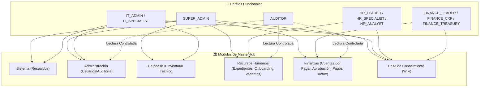

# 🛡️ Matriz de Perfiles, Roles y Permisos RBAC/PBAC (MasterHub)

*Arquitectura de control de acceso basada en roles y dominios funcionales (RBAC/PBAC) para la plataforma corporativa MasterHub (`MG-HUB`), orquestada por Grandalf y la Comunidad del Anillo.*

---

## 🏛️ 1. Arquitectura de Seguridad y Dominios

A diferencia del esquema plano anterior (`SUPER_ADMIN`, `ADMIN`, `USER`), MasterHub cuenta con una **segregación estricta de funciones por departamento de negocio**. Los usuarios únicamente tienen acceso visual y operativo a los módulos vinculados a su cargo oficial.

---

## 📊 2. Matriz de Acceso por Módulo

| Módulo / Sección | Rutas del Dashboard | Roles Autorizados | Restricciones de Acceso |
| :--- | :--- | :--- | :--- |
| **Finanzas** | `/dashboard/finance/*` (CxP, Aprobación, Pagos) | `SUPER_ADMIN`, `ADMIN`, `FINANCE_LEADER`, `FINANCE_ANALYST`, `FINANCE_CXP`, `FINANCE_TREASURY`, `FINANCE_ASSISTANT` | **Bloqueado 100% para RRHH**. Redirección 403. |
| **Recursos Humanos** | `/dashboard/hr/*` (Expedientes, Reclutamiento, Vacantes, Indicadores) | `SUPER_ADMIN`, `ADMIN`, `HR_LEADER`, `HR_SPECIALIST`, `HR_ANALYST`, `HR_ASSISTANT` | **Bloqueado 100% para Finanzas**. Redirección 403. |
| **Helpdesk** | `/dashboard/helpdesk/*` (Tickets, Mesa de Ayuda) | `SUPER_ADMIN`, `ADMIN`, `IT_ADMIN`, `IT_SPECIALIST` | Exclusivo equipo IT y soporte. |
| **Inventario & Sedes** | `/dashboard/sites`, `/dashboard/products` | `SUPER_ADMIN`, `ADMIN`, `IT_ADMIN`, `IT_SPECIALIST`, `HR_LEADER` | Gestión de activos y sedes corporativas. |
| **Usuarios & Roles** | `/dashboard/users` | `SUPER_ADMIN`, `ADMIN`, `IT_ADMIN` | Configuración de cuentas y asignación de roles. |
| **Sistema & Respaldos**| `/dashboard/backups` | `SUPER_ADMIN`, `ADMIN`, `IT_ADMIN` | Operaciones de infraestructura y backups. |
| **Base de Conocimiento**| `/dashboard/wiki/*` | Todos los usuarios autenticados | Documentación interna compartida. |

---

## 👥 3. Nómina de Usuarios Corporativos y Perfiles Asignados (`auth_db`)

### 💻 Tecnología & Sistemas (IT)
| Usuario | Nombre Completo | Correo Corporativo | Perfil Asignado |
| :--- | :--- | :--- | :--- |
| `@vmontoya` | Víctor Hugo Montoya | `vmontoya@mastergroupve.com` | `SUPER_ADMIN`, `IT_ADMIN` |
| `@rsimoza` | Ronny Simoza | `rsimoza@mastergroupve.com` | `IT_SPECIALIST`, `ADMIN` |

### 👥 Recursos Humanos (RRHH)
| Usuario | Nombre Completo | Correo Corporativo | Perfil Asignado |
| :--- | :--- | :--- | :--- |
| `@mhernandez` | María Fernanda Hernández Manchego | `mhernandez@mastergroupve.com` | `HR_LEADER` |
| `@erodriguez` | Esthefany Del Valle Rodríguez López | `erodriguez@mastergroupve.com` | `HR_SPECIALIST` |
| `@scharinga` | Sheila Eloisa Charinga García | `scharinga@mastergroupve.com` | `HR_SPECIALIST` |
| `@ecolmenares` | Eva Angelina Colmenares Rivas | `ecolmenares@mastergroupve.com` | `HR_ANALYST` (Reclutamiento) |
| `@mmendoza` | María Fernanda Mendoza Giménez | `mmendoza@mastergroupve.com` | `HR_ANALYST` |
| `@sramos` | Stefany Alejandra Ramos Rodríguez | `sramos@mastergroupve.com` | `HR_ANALYST` |
| `@aromero` | Andrea Romero Albarrán | `aromero@mastergroupve.com` | `HR_ANALYST` (Nómina) |
| `@mquintero` | María Fernanda Quintero | `mquintero@mastergroupve.com` | `HR_ASSISTANT` |

### 💰 Finanzas & Administración
| Usuario | Nombre Completo | Correo Corporativo | Perfil Asignado |
| :--- | :--- | :--- | :--- |
| `@jromero` | Jessica Andreina Romero Figuera | `jromero@mastergroupve.com` | `FINANCE_LEADER` |
| `@ydavid` | Yorkelis Virginia David Brito | `ydavid@mastergroupve.com` | `FINANCE_ANALYST` |
| `@bmanzanilla` | Bárbara Celeste Manzanilla Bruzual | `bmanzanilla@mastergroupve.com` | `FINANCE_CXP` |
| `@hramos` | Hilary Patricia Ramos González | `hramos@mastergroupve.com` | `FINANCE_CXP` |
| `@mmoreno` | María De Los Ángeles Moreno Rodríguez | `mmoreno@mastergroupve.com` | `FINANCE_CXP` |
| `@yteran` | Yeison Omar Terán Cristancho | `yteran@mastergroupve.com` | `FINANCE_CXP` |
| `@rsanguino` | Rosibel Del Carmen Sanguino Guevara | `rsanguino@mastergroupve.com` | `FINANCE_ANALYST` |
| `@dblanco` | Daniela Alejandra Blanco Carrillo | `dblanco@mastergroupve.com` | `FINANCE_ANALYST` |
| `@mespitia` | Mayra Alejandra Espitia Serrano | `mespitia@mastergroupve.com` | `FINANCE_TREASURY` |
| `@mpiovoso` | María Isabella Piovoso Carlino | `mpiovoso@mastergroupve.com` | `FINANCE_ASSISTANT` |

*Nota de Seguridad*: Se han purgado y eliminado todas las referencias a correos personales en la base de datos de autenticación. Las cuentas corporativas se autentican directamente con su nombre de usuario (ej. `jromero`) y su contraseña provisional estándar (`MasterGroup2026!`).

---

## ⚙️ 4. Mecanismo de Blindaje Técnico

### A. Backend (`api-gateway` & `RolesGuard`)
En `apps/api-gateway/src/common/guards/roles.guard.ts`:
- Expansión automática de roles jerárquicos: `SUPER_ADMIN` tiene acceso omnipotente (`*`), `HR_LEADER` engloba especialistas y analistas, y `FINANCE_LEADER` engloba analistas y operadores de CxP.
- Bloqueo en controladores de entrada (`@Roles(...)`) con respuesta `403 Forbidden` inmediata si el token no contiene el rol exigido.

### B. Frontend (`DashboardShell` & `AuthGuard`)
- **Menú Lateral Reactivo (`dashboard-shell.tsx`)**: Cada sección evalúa `allowedRoles`. Si un analista de Finanzas inicia sesión, las secciones de Recursos Humanos, Helpdesk y Respaldos desaparecen por completo de su vista.
- **Protección de Rutas Directas (`auth-guard.tsx`)**: Si un usuario intenta forzar la navegación tipeando una URL directa (ej. `/dashboard/hr/employees`), el `AuthGuard` intercepta la ruta y despliega una vista formal con banner de **"Acceso Restringido (403)"**, indicando su perfil actual y bloqueando la carga de datos.
