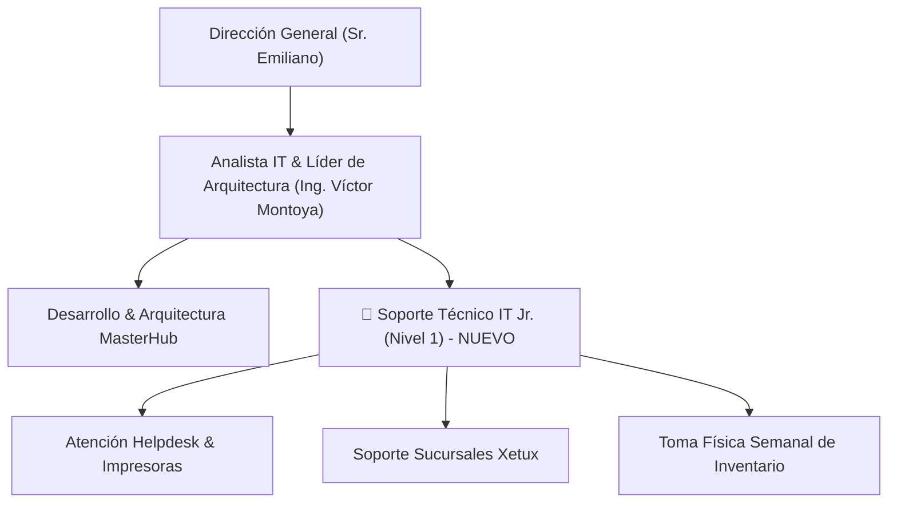

# 📋 Perfil de Cargo: Soporte Técnico IT Jr. (Nivel 1)

**Empresa:** Master Group VE  
**Departamento:** Tecnología e Infraestructura IT  
**Título del Cargo:** Soporte Técnico IT Jr. (Nivel 1)  
**Reporta a:** Analista IT & Líder de Arquitectura (Ing. Víctor Montoya)  
**Supervisa a:** N/A (Posición Operativa Nivel 1)  
**Modalidad / Ubicación:** Presencial (Sedes de Master Group & Oficinas Centrales)  

---

## 🎯 1. Propósito Principal del Cargo

Atender de forma oportuna, proactiva y estructurada la atención reactiva Helpdesk Nivel 1, mantenimiento de hardware/periféricos, soporte básico a cajeros y gerentes en sucursales Xetux, y la ejecución de levantamientos físicos semanales de inventario tecnológico, liberando al 100% el *Focus Time* del área de arquitectura y desarrollo de software.

---

## 🏢 2. Estructura Organigráfica & Dependencia

---

## ⚙️ 3. Funciones Principales & Responsabilidades

### A. Soporte Técnico Operativo (Helpdesk Nivel 1)
1. **Recepción y Atención de Tickets:** Registrar, categorizar y resolver los tickets reactivos de nivel 1 ingresados en la plataforma **MasterHub (Helpdesk)**.
2. **Atención a Equipos de Computación:** Formateo de laptops/desktops, instalación de SO Windows 10/11, drivers, paquetería de oficina y software corporativo.
3. **Mantenimiento de Periféricos e Impresoras:** Cambio de toners, desatasco de papel, reemplazo de cables, configuración de spooler de impresión y atención a balanzas comerciales.
4. **Mantenimiento Físico Preventivo:** Limpieza interna/externa de computadores, ventiladores, fuentes de poder y peinado de cables estructurados en puestos de trabajo.

### B. Soporte a Sucursales & Sistema de Puntos de Venta (Xetux)
1. **Asistencia Telefónica y Remota a Cajeros:** Atender de forma ágil las incidencias en puntos de venta de tiendas (fallas de visualización, conectividad de cajas, visores de cliente).
2. **Revisión de Conectividad Local:** Diagnóstico básico de cableado de red RJ45, puntos de acceso Wi-Fi y reinicio estructurado de routers/switches en sedes.

### C. Control & Levantamiento Semanal de Inventario
1. **Toma Física Recurrente:** Ejecutar las jornadas semanales de inventariado físico de equipos en sedes para garantizar la exactitud de datos en MasterHub.
2. **Recepción y Etiquetado:** Asignar y pegar etiquetas de código de barras/QR a los nuevos activos informáticos antes de su entrega.

---

## 👤 4. Perfil del Candidato (Requisitos del Cargo)

### A. Formación Académica
* **Nivel Educativo:** Técnico Medio en Informática, Estudiante universitario de los primeros semestres de Ingeniería en Sistemas, Computación o carrera afín.

### B. Experiencia Previa
* **Experiencia deseable:** 6 meses a 1 año en atención de Helpdesk, soporte técnico de campo o mantenimiento informático *(no limitante si demuestra alta proactividad técnico-práctica)*.

### C. Conocimientos Técnicos Requeridos
* Ensamblaje, formateo y mantenimiento de hardware de PC / Laptops.
* Instalación y configuración de Windows 10/11 y utilitarios.
* Configuración e instalación de impresoras (USB / Red / Spooler).
* Conocimientos básicos de redes TCP/IP, armado y crimpado de cables UTP RJ45.
* Manejo básico de plataformas de Helpdesk/Tickets.

### D. Competencias & Habilidades Blandas
* **Proactividad e Iniciativa:** Disposición para resolver sin esperar indicaciones reiteradas.
* **Orientación al Servicio & Empatía:** Excelente trato verbal y escrito con usuarios internos y personal de tienda.
* **Disciplina & Puntualidad:** Cumplimiento estricto de horarios y cronogramas de toma física.
* **Capacidad de Organización:** Manejo ordenado de piezas, repuestos e inventario.

---

## 📊 5. Indicadores Clave de Desempeño (KPIs)

| Indicador | Meta Esperada | Frecuencia de Medición |
| :--- | :--- | :--- |
| **Tiempo de Respuesta a Tickets Nivel 1** | `< 15 minutos` | Semanal |
| **Tiempo Promedio de Solución de Tickets** | `< 2 horas` | Quincenal |
| **Cumplimiento de Toma Física de Inventario** | `100% de sedes asignadas` | Semanal |
| **Satisfacción del Usuario Interno** | `> 95% de valoración positiva` | Mensual |

---

## 🗓️ 6. Plan de Inducción de 30 Días

* **Semana 1:** Inducción en plataforma MasterHub, entrega de accesos, inventariado inicial y acompañamiento en sucursales Xetux.
* **Semana 2:** Asignación autónoma de tickets Nivel 1 y manejo independiente del canal de atención telefónica a cajeros.
* **Semana 3-4:** Asunción total del control de inventarios semanales y reporte directo de gestión semanal al Analista IT.
