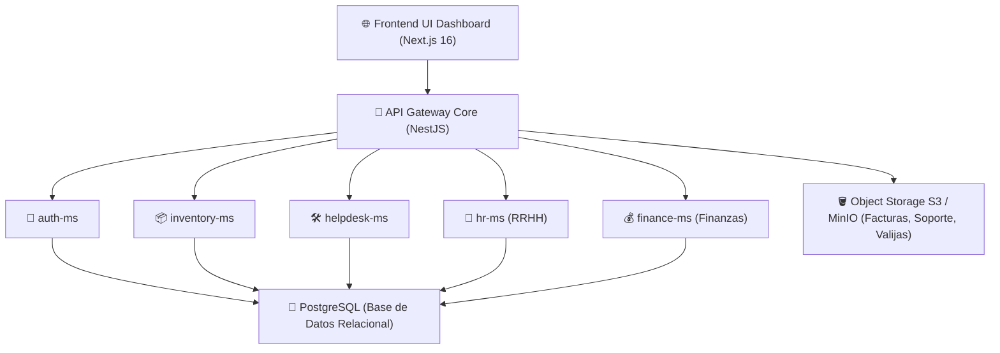

```text
====================================================================================================
                                      🏢 MASTER GROUP VENEZUELA
                       DEPARTAMENTO DE TECNOLOGÍA E INFRAESTRUCTURA IT
                              MEMBRETE CORPORATIVO DE DIRECCIÓN
====================================================================================================
```

# 📋 PROPUESTA EMPRESARIAL DE INFRAESTRUCTURA CLOUD Y SERVICIOS DE IA

**CÓDIGO DE DOCUMENTO:** `PROP-MGH-2026-004`  
**FECHA DE EMISIÓN:** Jueves, 17 de Septiembre de 2026  
**PARA:** Sr. Emiliano — Dirección General, Master Group VE  
**DE:** Ing. Víctor Montoya — Analista IT & Líder de Arquitectura  
**ASUNTO:** Análisis Comparativo de Servidores Cloud para MasterHub (MGH) y Presupuesto Operativo de Modelos de Inteligencia Artificial (IA)  

---

## 🎯 1. Resumen Ejecutivo

El presente documento expone la evaluación técnica y económica para el despliegue en producción de la plataforma **MasterHub (MGH)** —suite multimicroservicio que integra los módulos de Autenticación, Helpdesk, Inventario, Recursos Humanos y Finanzas— así como la estructura de costos para la integración de modelos de **Inteligencia Artificial (IA)** para automatizaciones operativas.

### 💡 Cifra Consolidada de Inversión Sugerida:
* **Infraestructura de Servidor Nube (MasterHub)**: **$20.00 USD / mes**
* **Consumo Operativo de Inteligencia Artificial**: **$0.00 a $5.00 USD / mes**
* **INVERSIÓN TOTAL MENSUAL ESTIMADA**: **~$20.00 – $25.00 USD / mes** *($240.00 – $300.00 USD / año)*

---

## 🏗️ 2. Footprint Técnico de MasterHub (MGH)

Para garantizar un rendimiento óptimo de la plataforma sin interrupciones ni cuellos de botella, la infraestructura hospedará los siguientes componentes activos:



1. **7 Contenedores Docker Activos**: `frontend-ui-dashboard`, `api-gateway`, `auth-ms`, `inventory-ms`, `helpdesk-ms`, `hr-ms`, `finance-ms`.
2. **Bases de Datos Relacionales PostgreSQL**: Bases de datos aisladas y respaldadas automáticamente.
3. **Almacenamiento de Archivos S3**: Para guardar comprobantes, valijas digitales, documentos de RRHH y facturas del SENIAT.

---

## ☁️ 3. Cuadro Comparativo de Opciones de Servidor (Hosting Cloud)

Se auditaron 4 alternativas de mercado comparando precio, rendimiento de hardware y nivel de control:

| Opción de Proveedor | Especificación de Hardware | Costo Mensual | Costo Anual | Ventajas Competitivas |
| :--- | :--- | :---: | :---: | :--- |
| **🏆 Opción 1: Hetzner Cloud + Coolify PaaS (RECOMENDADA)** | **CPX31**: 4 vCPU AMD EPYC (Dedicadas), 8 GB RAM, 160 GB NVMe SSD, Caddy SSL Gratis | **$15 – $25 USD** | **$180 – $300 USD** | **Costo 100% Fijo y Predecible**. Desempeño ultrarrápido con SSD NVMe. Despliegue automático directo desde GitHub. |
| **Opción 2: Híbrido PaaS (Railway / Render + Aiven DB)** | Microservicios Serverless + Base de datos administrada Aiven | **$35 – $65 USD** | **$420 – $780 USD** | Cero mantenimiento de servidor, pero escala el costo por contenedor activo 24/7. |
| **Opción 3: DigitalOcean** | DigitalOcean App Platform + Managed DB + Spaces S3 | **$48 – $85 USD** | **$576 – $1,020 USD** | Panel de administración de estándar empresarial. |
| **Opción 4: AWS (Amazon Web Services)** | AWS App Runner / ECS Fargate + RDS PostgreSQL + S3 | **$70 – $130 USD** | **$840 – $1,560 USD** | Infraestructura tradicional corporativa. Alta complejidad y sobrecostos por tráfico saliente. |

### 📌 Razonamiento de la Selección de Hetzner Cloud:
Hetzner Cloud ofrece la mejor relación precio/potencia del mercado. Al utilizar **Coolify** (plataforma de orquestación Open Source auto-hospedada), la empresa obtiene su propia nube privada sin pagar mensualidades por usuario o contenedor adicional.

---

## 🤖 4. Análisis de Costos de Modelos y Planes de Inteligencia Artificial (IA)

Se evaluaron las principales opciones de IA del mercado para dar soporte tanto a los asistentes de automatización corporativa (Bot ALFRED) como al procesamiento inteligente de datos en MasterHub:

| Proveedor / Modelo | Modalidad de Servicio | Tarifa por Tokens / Usuario | Nivel de Adaptación & Recomendación |
| :--- | :--- | :--- | :--- |
| **Google Gemini (Gemini 3.6 Flash / 2.5 Flash)** 🏆 | API Studio / Vertex | **Nivel Gratuito (15 RPM)** / **$0.075 input - $0.30 output por 1M tokens** | **Motor Principal Recomendado**: Excelente velocidad, soporte para notas de voz, visión y PDFs con un costo operativo cercano a **$0 USD/mes**. |
| **Google Gemini (Gemini 3.6 Pro)** | API Studio / Vertex | $1.25 input - $5.00 output por 1M tokens | Razonamiento avanzado para informes financieros extensos y exégesis. |
| **OpenAI (GPT-4o-mini)** | API HTTP | $0.15 input - $0.60 output por 1M tokens | Clasificación rápida de tickets e ingesta de soporte. |
| **OpenAI (ChatGPT Plus / GPT-4o)** | Licencia Usuario / API | $20 USD/mes por usuario / API $2.50-$10.00 por 1M tokens | Licencia individual para asistentes de codificación/copilot. |
| **Anthropic Claude (Claude 3.5 Sonnet)** | Licencia Usuario / API | $20 USD/mes por usuario / API $3.00-$15.00 por 1M tokens | Refactorización compleja de arquitecturas de software. |

---

## 💰 5. Presupuesto Consolidado Final para Aprobación

```text
+--------------------------------------------------------------------------------------------------+
|                               RESUMEN DE PRESUPUESTO OPERATIVO                                  |
+--------------------------------------------------------------------------------------------------+
| 1. Servidor Cloud Hetzner Dedicated vCPU (MasterHub MGH) .................. $ 20.00 USD / mes    |
| 2. Licencia / API de Inteligencia Artificial (Google Gemini 3.6 Flash) .... $  0.00 USD / mes    |
| 3. Resguardo & Copias de Seguridad Automáticas (S3 Object Storage) ......... $  3.00 USD / mes    |
+--------------------------------------------------------------------------------------------------+
| TOTAL INVERSIÓN MENSUAL ESTIMADA: ........................................... $ 23.00 USD / mes    |
| TOTAL INVERSIÓN ANUAL PROYECTADA: .......................................... $276.00 USD / año    |
+--------------------------------------------------------------------------------------------------+
```

### 📈 Comparativa de Ahorro para Master Group VE:
* **Costo de Software Tradicional Comercial (Profit / Odoo / SAP)**: `$5,000.00 - $12,000.00 USD / año`
* **Costo de Solución Propia MasterHub (Servidor + IA)**: **`$276.00 USD / año`**
* **AHORRO ESTIMADO PARA LA EMPRESA**: **`> 95% de reducción de costos operativos en TI`**

---

## 📝 6. Próximos Pasos Recomendados

1. **Aprobación de la Opción 1 (Hetzner Cloud)** para la creación de la cuenta corporativa de servidores.
2. **Configuración del Servidor VPS CPX31** y despliegue del orquestador **Coolify**.
3. **Migración del entorno de MasterHub** a producción bajo el dominio corporativo de Master Group.

---

```text
====================================================================================================
                        Master Group VE — Departamento de Tecnología e IT
                    Ing. Víctor Montoya | Analista IT & Líder de Arquitectura
====================================================================================================
```
