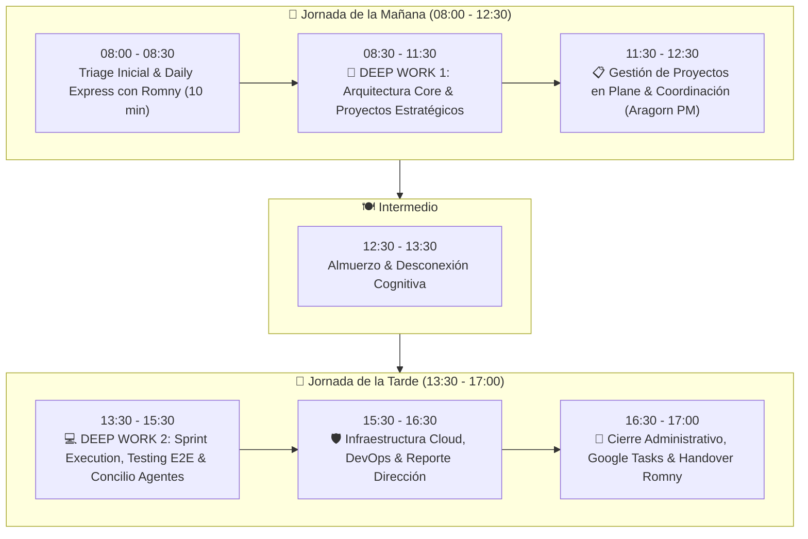

# 👑 Estándar de Time-Blocking: Líder de IT & Arquitectura Tecnológica

**Ocupante:** Ing. Víctor Montoya  
**Rol:** Líder de IT & Arquitectura Tecnológica  
**Reporta a:** Dirección General (Sr. Emiliano)  
**Supervisa a:** Desarrolladores de Software, Analista QA, Soporte Técnico IT Jr. (Romny Simoza)  
**Horario Laboral:** Lunes a Viernes, 08:00 – 17:00 (Hora Legal de Venezuela, UTC-4)  
**Calendario Principal:** `vmontoya@mastergroupve.com`

---

## 🎯 Principio Operativo: La Regla 70 / 20 / 10

Para garantizar que el crecimiento tecnológico de Master Group avance sin verse estancado por la operación reactiva, la jornada se distribuye en:
* **70% Ingeniería & Arquitectura (5.0 Horas):** Dos bloques de **Deep Work** protegidos por el escudo operativo de Nivel 1.
* **20% Gestión, Plane & Dirección (2.0 Horas):** Refinamiento ágil, desbloqueo de tareas y coordinación ejecutiva.
* **10% Triage, Sincronización & Handover (1.0 Hora):** Dailies con Romny y orden administrativo al inicio y cierre.

---

## ⏰ Cronograma Maestro Detallado

| Bloque | Horario | Enfoque | Actividades Clave | Sincronización con Romny |
| :--- | :--- | :--- | :--- | :--- |
| **1. Triage & Daily** | **08:00 – 08:30** | 🌅 Coordinación | Revisión de correo ejecutivo, alertas de servidores y Daily Standup de 10 min (08:20) con Romny. | Romny reporta estado de tiendas y activa su "escudo operativo". |
| **2. DEEP WORK 1** | **08:30 – 11:30** | 🧠 Foco Máximo (Alta Energía) | Arquitectura de MasterHub, modelado DB Prisma, PR reviews, diseño de nuevos proyectos (Menú Interactivo Beijing 2.0). | Romny en taller/mantenimiento (08:30-10:30) y pico de atención Xetux (10:30-13:00). |
| **3. Plane & PM** | **11:30 – 12:30** | 📋 Gestión Ágil | Refinamiento de Plane, estimación de Story Points, coordinación con líderes funcionales (Finanzas, RRHH). | Romny absorbe llamadas de tiendas. |
| **4. Almuerzo** | **12:30 – 13:30** | 🍽️ Pausa | Almuerzo y descanso sin pantallas. | Romny almuerza de 13:00 a 14:00. |
| **5. DEEP WORK 2** | **13:30 – 15:30** | 💻 Foco Técnico | Testing E2E (Onboarding, CxP), ejecución técnica del Sprint activo con subagentes (Legolas, Elrond, Frodo). | Romny en trabajo de campo / toma física de inventario en sucursales. |
| **6. Infra & Dirección** | **15:30 – 16:30** | 🛡️ Gobernanza | Auditoría de backups, CI/CD en GitHub Actions, preparación de staging y reporte ejecutivo al Sr. Emiliano. | Romny concluye ruta de sedes. |
| **7. Cierre & Handover** | **16:30 – 17:00** | 🌆 Desconexión | Cierre de Google Tasks, actualización de 2brain y Handover de 15 min (16:45) con Romny sobre tickets resueltos. | Romny entrega turno a las 16:45 y sale a las 17:00. |

---

## 🛡️ Políticas de Blindaje del Tiempo

1. **El Escudo de Romny es Innegociable:** Ningún usuario administrativo o cajero de Xetux debe interrumpir los bloques de *Deep Work*. Cualquier solicitud directa debe ser redirigida a la mesa de ayuda o al canal de Romny.
2. **Definición de Urgencia:** Solo se interrumpe un *Deep Work* si se produce una caída general de producción (servidor central offline o caída de base de datos) que afecte simultáneamente a toda la red de tiendas.
3. **Puntualidad en los Dailies:** Las reuniones de sincronización con Romny tienen un límite estricto de **10 a 15 minutos**. Son para desbloqueo y prioridades, no para debates técnicos largos.
